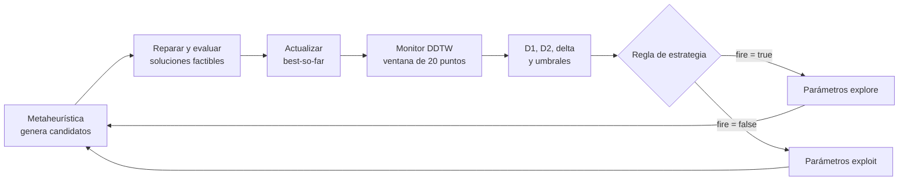

# Algoritmo central: control DTW de metaheurísticas binarias para MKP

Este documento describe la implementación ejecutable actual del proyecto. El sistema resuelve el **problema multidimensional de la mochila (MKP)** mediante una de cuatro metaheurísticas binarias y, en dos variantes, utiliza una señal DTW para alternar sus parámetros entre exploración y explotación.

> **Idea esencial:** DTW **no optimiza la mochila, no genera soluciones y no reemplaza a la metaheurística**. Funciona como un controlador externo: observa la curva del mejor fitness histórico, estima si se parece a progreso o a estancamiento y ordena un cambio de parámetros.

## Resumen en 30 segundos

1. Una solución MKP es un vector binario: cada bit indica si un ítem entra en la mochila.
2. PSO, GA, GWO o DE genera candidatos. Todo candidato se repara para satisfacer las restricciones y luego se evalúa por su beneficio total.
3. La metaheurística conserva el mejor fitness encontrado hasta el momento (*best-so-far*).
4. En `binary_simple` y `binary_hysteresis`, un monitor analiza una ventana deslizante de ese *best-so-far* mediante DDTW.
5. El monitor compara la ventana con dos referencias: una rampa de progreso y una constante de estancamiento.
6. La regla de la variante decide si la metaheurística usa parámetros `explore` o `exploit`.
7. Los baselines mantienen uno de esos modos durante toda la corrida y no usan DTW.

Las cuatro variantes activas son:

| Variante | Comportamiento |
|---|---|
| `vanilla_explotacion` | Modo `exploit` permanente; sin DTW. |
| `vanilla_exploracion` | Modo `explore` permanente; sin DTW. |
| `binary_simple` | Explora exactamente cuando $D_2 \leq \theta_c$. |
| `binary_hysteresis` | Entra en exploración cuando $\Delta \geq \theta_\Delta$ y sale cuando $\Delta \leq 0$. |

La carpeta `vanilla/` implementa el runner reutilizado internamente por `vanilla_explotacion`; no constituye una quinta estrategia activa en `run_all_hpc.py`.

## 1. Problema MKP, representación y reparación

### 1.1 Formulación

Para $n$ ítems y $m$ recursos, el MKP maximiza:

$$
\max_{x \in \{0,1\}^n} f(x)=\sum_{j=1}^{n}p_jx_j
$$

sujeto a:

$$
\sum_{j=1}^{n}r_{ij}x_j \leq b_i,
\qquad i=1,\dots,m.
$$

Donde:

- $x_j=1$ significa que se selecciona el ítem $j$;
- $p_j$ es su beneficio;
- $r_{ij}$ es el consumo del recurso $i$ por el ítem $j$;
- $b_i$ es la capacidad disponible del recurso $i$.

El fitness utilizado por todas las metaheurísticas es el beneficio de una **solución factible reparada**:

$$
f(x)=p^\top x.
$$

### 1.2 Densidad y reparación greedy

La carga de la instancia calcula una densidad por ítem. Primero normaliza cada consumo por la capacidad correspondiente y promedia entre restricciones:

$$
\bar r_j=\frac{1}{m}\sum_{i=1}^{m}\frac{r_{ij}}{b_i},
\qquad
d_j=\frac{p_j}{\bar r_j+10^{-12}}.
$$

La función `reparar()` aplica dos fases determinísticas:

1. **Eliminar:** recorre los ítems seleccionados desde menor a mayor densidad y los retira hasta que se cumplan todas las capacidades.
2. **Completar:** recorre los ítems no seleccionados desde mayor a menor densidad; agrega cada uno si la solución sigue siendo factible y revierte la adición en caso contrario.

Por lo tanto, las metaheurísticas pueden producir vectores inicialmente infactibles, pero el fitness y el mejor global se calculan siempre sobre el vector reparado que retorna la función.

## 2. Arquitectura y separación de responsabilidades

| Componente | Responsabilidad |
|---|---|
| `mkp_common/problem.py` | Cargar instancias, obtener el óptimo conocido, calcular densidades, reparar y evaluar soluciones. |
| `mkp_common/base.py` | Definir el contrato común `initialize()`, `step()`, `adapt()` y `get_best()`. El modo inicial es `exploit`. |
| `mkp_common/mh/` | Implementar la búsqueda y los parámetros de cada metaheurística. |
| `mkp_common/monitor.py` | Mantener el *best-so-far* y calcular $D_1$, $D_2$, $\Delta$ y sus umbrales. |
| `mkp_common/runner.py` | Ejecutar el ciclo MH → monitor → decisión → adaptación. |
| `binary_*/config.py` | Definir la regla que transforma las métricas DTW en una orden booleana de modo. |
| `vanilla*/runner.py` | Ejecutar los baselines sin monitor ni adaptación dinámica. |
| `run_all_hpc.py` | Construir y paralelizar las tareas estrategia × MH × epoch, guardar resultados y lanzar el análisis estadístico. |

Esta separación es importante: el monitor no conoce los operadores de PSO, GA, GWO o DE; solo recibe un escalar. A su vez, cada metaheurística recibe únicamente `fire=True/False` y no necesita conocer cómo se obtuvo la señal.

## 3. Pseudocódigo de extremo a extremo

```text
entrada: instancia MKP, metaheurística, estrategia, población, iteraciones, semilla

cargar beneficios, consumos, capacidades y óptimo conocido
crear generador aleatorio con la semilla
crear MH                                 // BaseMH inicia en exploit

si la estrategia usa DTW:
    crear StagnationMonitor
    crear la función/controlador de decisión

MH.initialize()                          // generar, reparar y evaluar población

para cada iteración:
    mejor_fitness = MH.step()             // una iteración de búsqueda completa

    si la estrategia usa DTW:
        señal = monitor.update(mejor_fitness)
        si señal.ready:
            fire = estrategia.decidir(señal)
            MH.adapt(fire)                // cambia parámetros para la próxima iteración

    registrar mejor_fitness y modo vigente

devolver mejor solución factible y métricas de la corrida
```

El orden exacto tiene una consecuencia: la adaptación ocurre **después** de `step()`. Por ello, un cambio de modo decidido en la iteración $t$ afecta a `step()` de la iteración $t+1$, no a la ya ejecutada.

## 4. Ciclo común de las metaheurísticas

Las cuatro implementaciones siguen el mismo contrato:

1. **Inicialización:** generan una población, reparan cada candidato, calculan su fitness y establecen el mejor conocido.
2. **Paso:** aplican sus operadores específicos, binarizan cuando corresponde, reparan y evalúan.
3. **Memoria del mejor:** actualizan el mejor global solo cuando encuentran un fitness superior. En consecuencia, el valor devuelto por `step()` es monótono no decreciente.
4. **Adaptación:** `adapt(True)` activa parámetros de exploración; `adapt(False)` restaura explotación. El cambio es discreto y afecta globalmente a la metaheurística.
5. **Resultado:** `get_best()` retorna la mejor solución factible histórica y su fitness.

Conviene distinguir cuatro conceptos:

| Concepto | Significado |
|---|---|
| **Candidato** | Vector producido por los operadores; puede ser infactible antes de reparar. |
| **Solución factible** | Vector reparado que cumple $Rx\leq b$. |
| **Best-so-far** | Mejor fitness factible encontrado hasta la iteración actual. Es la única entrada del monitor. |
| **Modo** | Conjunto de parámetros `explore` o `exploit`; no es una solución ni una métrica de calidad. |

## 5. Metaheurísticas y parámetros adaptados

### 5.1 Binary PSO

Cada partícula conserva su mejor posición personal, `pbest`, y el mejor global, `gbest`. Actualiza su velocidad mediante:

$$
v_i \leftarrow wv_i+c_1r_1\odot(pbest_i-x_i)+c_2r_2\odot(gbest-x_i),
$$

la limita a $[-6,6]$ y muestrea cada bit con:

$$
P(x_{ij}=1)=\sigma(v_{ij})=\frac{1}{1+e^{-v_{ij}}}.
$$

| Modo | $w$ | $c_1$ | $c_2$ | Lectura operacional |
|---|---:|---:|---:|---|
| `exploit` | 0.729 | 1.49445 | 1.49445 | Inercia moderada y balance entre memoria personal y guía global. |
| `explore` | 0.9 | 2.5 | 0.5 | Más inercia y autonomía personal; menor atracción hacia `gbest`. |

### 5.2 Genetic Algorithm

Es un GA binario generacional con torneo de tamaño 3, crossover uniforme, mutación *bit-flip* y elitismo de 2 individuos. Cada pareja se cruza con probabilidad `crossover_rate`; luego cada bit de cada descendiente se invierte independientemente con probabilidad `mutation_rate`.

| Modo | Crossover | Mutación | Parámetros fijos |
|---|---:|---:|---|
| `exploit` | 0.9 | 0.01 | torneo = 3, elitismo = 2 |
| `explore` | 0.6 | 0.15 | torneo = 3, elitismo = 2 |

El mejor global histórico se conserva, y los dos mejores individuos de la generación pasan sin modificación a la siguiente.

### 5.3 Binary GWO

Los tres mejores individuos actuales actúan como líderes $\alpha$, $\beta$ y $\delta$. Para cada líder $k$:

$$
A_k=2ar_{1,k}-a,\qquad C_k=2r_{2,k},
$$

$$
D_k=|C_kX_k-X|,\qquad X'_k=X_k-A_kD_k.
$$

Luego se promedian las tres propuestas, se aplica una sigmoide y se muestrea el vector binario:

$$
X_{nuevo}=\frac{X'_\alpha+X'_\beta+X'_\delta}{3}.
$$

| Modo | $a$ | Efecto |
|---|---:|---|
| `exploit` | 0.5 | $A_k\in[-0.5,0.5]$; favorece movimientos próximos a los líderes. |
| `explore` | 2.0 | $A_k\in[-2,2]$; permite movimientos que se alejan de los líderes. |

A diferencia del GWO clásico, aquí $a$ no decrece linealmente con el tiempo: permanece fijo en uno de los dos valores y cambia solo por la política de la corrida.

### 5.4 Binary Differential Evolution

DE mantiene una representación continua para operar y una binaria reparada para evaluar. Implementa `DE/rand/1/bin`:

$$
v=x_{r1}+F(x_{r2}-x_{r3}).
$$

El vector se limita a $[-6,6]$. El crossover binomial construye $u$ tomando cada componente del mutante con probabilidad $CR$ y garantiza al menos una componente mutante. Después, $u$ se binariza mediante sigmoide, se repara y compite con su individuo objetivo. El reemplazo ocurre si el nuevo fitness es mayor o igual.

| Modo | $F$ | $CR$ | Lectura operacional |
|---|---:|---:|---|
| `exploit` | 0.5 | 0.9 | Perturbación diferencial atenuada aplicada a muchas dimensiones. |
| `explore` | 0.9 | 0.3 | Perturbación más intensa aplicada a una fracción menor de dimensiones. |

## 6. Monitor DTW

### 6.1 Curva observada y ventana

El monitor recibe el mejor fitness reportado por `step()`. Si el nuevo valor no supera el anterior, replica el mejor previo y aumenta `no_improve_len`; si mejora, reinicia ese contador. Así construye:

$$
B_t=\max(B_{t-1},f_t).
$$

Cuando existen al menos $W$ observaciones, toma:

$$
X_t=[B_{t-W+1},\dots,B_t].
$$

La configuración compartida actual es:

| Parámetro | Valor actual | Uso |
|---|---:|---|
| `window` | 20 | Longitud $W$ de la ventana. |
| `band` | 2 | Banda Sakoe–Chiba: restringe el alineamiento a $|i-j|\leq2$. |
| `min_slope` | 2.0 | Pendiente de la rampa de referencia. |
| `use_ddtw` | `True` | Aplica DTW a primeras diferencias. |
| `adapt_thresholds` | `True` | Activa percentiles luego de suficiente historial. |
| `p_low` / `p_high` | 30 / 70 | Percentiles inferior y superior. |
| `plateau_max` / `patience` | 4 / 2 | Alimentan la regla interna del monitor, pero las dos reglas activas no usan `out["fire"]`. |

### 6.2 Referencias

Ambas referencias comienzan en el primer valor de la ventana:

$$
R_i=X_0+s_{min}i,\qquad C_i=X_0,\qquad i=0,\dots,W-1.
$$

Con la configuración vigente, $s_{min}=2.0$. Por tanto, la rampa representa una mejora ideal de dos unidades de fitness por iteración y la constante representa ausencia total de mejora.

### 6.3 Primera diferencia y DDTW

La implementación define:

$$
\nabla X=[0, X_1-X_0, X_2-X_1,\dots,X_{W-1}-X_{W-2}].
$$

El primer elemento es cero porque se usa `np.diff(X, prepend=X[0])`. DDTW se calcula como DTW sobre estas primeras diferencias:

$$
DDTW(S,T)=DTW(\nabla S,\nabla T).
$$

Esto elimina el efecto de un **desplazamiento vertical constante** del fitness y centra la comparación en los incrementos. No vuelve a la métrica estrictamente invariante a cambios multiplicativos de escala: si todos los incrementos se multiplican por un factor, los costos absolutos también cambian.

### 6.4 Distancia DTW

Para dos secuencias $S$ y $T$, el costo local es absoluto:

$$
c(i,j)=|S_i-T_j|.
$$

La recurrencia implementada es:

$$
D(i,j)=c(i,j)+\min\{D(i-1,j),D(i,j-1),D(i-1,j-1)\},
$$

con $D(0,0)=0$ y las demás fronteras inicializadas en infinito. Solo se evalúan celdas dentro de la banda. La distancia devuelta es el costo acumulado $D(n,m)$; no se normaliza por la longitud del camino.

### 6.5 Señales $D_1$, $D_2$ y $\Delta$

Como `use_ddtw=True`:

$$
D_1=DDTW(X,R),\qquad D_2=DDTW(X,C),\qquad \Delta=D_1-D_2.
$$

| Señal | Valor bajo | Valor alto |
|---|---|---|
| $D_1$ | La secuencia de mejoras se parece a la rampa. | Se aleja del progreso ideal. |
| $D_2$ | La secuencia de mejoras se parece a una constante. | Se aleja de una meseta. |
| $\Delta$ | Si es negativo, $X$ está más cerca de la rampa. | Si es positivo, $X$ está más cerca de la constante. |

Estas señales describen la **forma del best-so-far**, no la diversidad de la población ni la distancia al óptimo global.

### 6.6 Umbrales y warm-up

Durante las primeras $W-1=19$ observaciones, `ready=False` y no se llama a `adapt()`. Desde la observación 20 hay métricas válidas. Con $N$ iteraciones, existen:

$$
\max(0,N-W+1)
$$

observaciones `ready`.

En las primeras nueve observaciones válidas se usan umbrales fijos:

$$
\theta_c=0.1W=2,
\quad
\theta_r=0.5W=10,
\quad
\theta_\Delta=0.3W=6.
$$

Desde la décima observación válida, los umbrales se recalculan sobre **todo el historial acumulado** de señales:

$$
\theta_c=P_{30}(H_{D_2}),
\quad
\theta_r=P_{70}(H_{D_1}),
\quad
\theta_\Delta=P_{70}(H_\Delta).
$$

Aunque la función auxiliar se denomina `moving_percentile`, el código no limita estos historiales a una ventana adicional: crecen durante toda la corrida.

El monitor también calcula una regla interna de tres condiciones y `patience`, pero esa salida `fire` no controla ninguna de las dos variantes DTW activas. `binary_simple` y `binary_hysteresis` reciben las métricas y aplican sus propias reglas.

## 7. Reglas exactas de control

### 7.1 Binary-Simple

Su decisión es una función pura:

$$
fire_t=(D_{2,t}\leq\theta_{c,t}).
$$

- Si es verdadera, `adapt(True)` coloca la MH en `explore`.
- Si es falsa, `adapt(False)` la coloca en `exploit` si estaba explorando.
- No consulta $D_1$, $\Delta$, `no_improve_len`, `plateau_max`, `trigger_streak` ni `patience`.

Es una política reactiva: puede alternar de modo en observaciones consecutivas si $D_2$ cruza repetidamente el umbral.

### 7.2 Binary-Hysteresis

El controlador conserva su propio estado, inicialmente `exploit`:

$$
mode_t=
\begin{cases}
explore, & mode_{t-1}=exploit \land \Delta_t\geq\theta_{\Delta,t},\\
exploit, & mode_{t-1}=explore \land \Delta_t\leq0,\\
mode_{t-1}, & \text{en otro caso}.
\end{cases}
$$

La zona $0<\Delta<\theta_\Delta$ actúa como banda de histéresis: no cambia el estado. Esto separa el criterio de entrada del criterio de salida y reduce cambios rápidos alrededor de un único umbral.

En el runner HPC se crea un controlador nuevo para cada tarea/epoch. En cambio, el wrapper `binary_hysteresis.runner.run_epochs()` construye un solo controlador y lo reutiliza durante el lote de epochs; por ello, su estado interno puede pasar de un epoch al siguiente. Esta diferencia debe considerarse si se usa ese wrapper directamente.

## 8. Baselines

### Exploration-only (`vanilla_exploracion`)

Después de `initialize()`, ejecuta `mh.adapt(True)` una sola vez. La metaheurística permanece en `explore` durante toda la corrida. No crea un monitor, no calcula DTW y reporta `fire_count=0`.

### Exploitation-only (`vanilla_explotacion`)

Reutiliza `vanilla.runner`. Como `BaseMH` y las cuatro implementaciones comienzan con parámetros `exploit`, nunca llama a `adapt()` y conserva ese modo durante toda la corrida. Tampoco usa DTW y reporta `fire_count=0`.

Los baselines aíslan el efecto de mantener permanentemente cada régimen. Las variantes DTW se comparan contra esos extremos para estudiar si la alternancia informada aporta valor.

## 9. Interacción MH ↔ DTW



La realimentación ocurre únicamente a través de los parámetros. DTW no modifica bits, no repara soluciones, no calcula el fitness y no selecciona el mejor individuo.

## 10. Registro, corridas y comparación

### 10.1 Resultado interno de una corrida

El runner produce:

- mejor solución y mejor fitness;
- óptimo conocido y porcentaje alcanzado, denominado `ganancia`:
  $$100\,f_{best}/f^*$$
- historial por iteración del best-so-far;
- historial DTW completo en las variantes adaptativas;
- historial de modos;
- `fire_count`, que cuenta **entradas en `explore`**, no cada iteración con `fire=True`.

`run_epochs()` agrega tiempo, número de epoch y semilla. La convención es `semilla = epoch + 1`.

### 10.2 Ejecución HPC

`run_all_hpc.py` registra exactamente cuatro estrategias y cuatro metaheurísticas. Construye tareas independientes:

$$
\text{estrategia}\times\text{MH}\times\text{epoch}
$$

y las distribuye con `ProcessPoolExecutor`. Cada combinación del mismo índice de epoch usa la misma semilla, lo que permite emparejar resultados por semilla.

Los JSON se guardan por estrategia, instancia, corrida con timestamp y MH. Persisten:

- vector de fitness final por epoch;
- `fire_counts`, porcentajes alcanzados y tiempos;
- mejor, promedio, peor y desviación estándar del fitness;
- promedio y desviación estándar del tiempo;
- óptimo conocido y gap del **mejor epoch** cuando existe;
- metadatos de estrategia, instancia, población e iteraciones.

Los historiales detallados por iteración se usan para generar gráficos mientras están en memoria, pero `save_results()` no los incluye en esos JSON agregados.

### 10.3 Comparación estadística

Tras la ejecución, `analisis.estadistico` toma `vanilla_exploracion` como baseline y compara, para cada MH:

- `vanilla_explotacion`;
- `binary_simple`;
- `binary_hysteresis`.

Utiliza los vectores de fitness emparejados por orden de epoch/semilla. El test predeterminado es Wilcoxon signed-rank bilateral; `--one-sided` cambia la alternativa a “variante mayor que baseline”. También calcula Shapiro–Wilk sobre las diferencias emparejadas como diagnóstico y aplica corrección Holm–Bonferroni sobre todas las comparaciones MH × variante, con $\alpha=0.05$.

## 11. Ejemplo conceptual de estancamiento y recuperación

Supóngase que el best-so-far mejora al principio y luego permanece constante:

```text
... 22100, 22140, 22180, 22180, 22180, 22180, ...
```

1. Al llenarse la ventana con valores repetidos, sus primeras diferencias se aproximan a cero.
2. La distancia $D_2$ a la referencia constante disminuye.
3. La distancia $D_1$ a una rampa de pendiente 2 permanece relativamente alta; por ello, $\Delta=D_1-D_2$ tiende a ser positivo.
4. Binary-Simple entra en `explore` si $D_2\leq\theta_c$. Binary-Hysteresis entra si $\Delta\geq\theta_\Delta$.
5. La MH cambia sus parámetros y genera candidatos con un régimen más exploratorio.
6. Si aparece una solución factible mejor, el best-so-far sube. La ventana incorpora incrementos positivos: Binary-Simple saldrá cuando $D_2>\theta_c$; Binary-Hysteresis saldrá cuando $\Delta\leq0$.
7. La MH vuelve a parámetros de explotación para refinar la región prometedora.

La recuperación no está garantizada: el cambio de parámetros aumenta o redirige la exploración, pero puede no encontrar una solución mejor.

## 12. Límites e interpretación correcta

1. **Sensor, no optimizador:** DTW clasifica la forma reciente del best-so-far; la calidad de las soluciones depende de la MH y de la reparación.
2. **Información parcial:** una meseta del mejor fitness no implica que la población haya dejado de moverse o perdido diversidad. El monitor no observa esos estados.
3. **Estancamiento no equivale a error:** una curva plana también puede significar que ya se alcanzó el óptimo conocido.
4. **Costo no normalizado:** las distancias son sumas absolutas a lo largo del camino DTW. DDTW elimina desplazamientos verticales, pero no toda dependencia de escala.
5. **Reparación con sesgo:** el criterio de densidad favorece ciertos ítems y puede mapear candidatos distintos a soluciones reparadas iguales.
6. **Umbrales históricos:** los percentiles usan todo el historial disponible; no olvidan regímenes antiguos.
7. **Cambios posteriores al paso:** una decisión en la última iteración no puede afectar la búsqueda porque no existe un `step()` posterior.
8. **Configuración vigente reducida:** actualmente `NUM_ITERACIONES=20` y `EPOCHS=2`, mientras que $W=20$. Por ello hay una sola observación `ready`, el cambio de modo ocurre después del último paso y los umbrales adaptativos —que requieren diez observaciones válidas— no llegan a activarse. Los comentarios junto a esos valores muestran `#1000` y `#31`, pero el código no permite afirmar si son valores futuros, anteriores o experimentales. Para evaluar el efecto adaptativo real, el presupuesto debe superar ampliamente el warm-up y esta configuración debe justificarse explícitamente antes de producir resultados académicos.
9. **Persistencia de histéresis según runner:** el runner HPC aísla el controlador por epoch; el wrapper batch de `binary_hysteresis` puede reutilizarlo entre epochs.
10. **Resultados más recientes:** el análisis estadístico busca el directorio con nombre más reciente de cada estrategia. Si se mezclan ejecuciones parciales de timestamps distintos, debe verificarse que instancia, presupuesto y semillas sean comparables.

## 13. Guion breve para exposición oral

> “El proyecto resuelve el problema multidimensional de la mochila con cuatro metaheurísticas binarias: PSO, algoritmo genético, GWO y evolución diferencial. Cada candidato se repara mediante un criterio de densidad para asegurar factibilidad y se evalúa por su beneficio total. La contribución central no es reemplazar estas metaheurísticas por DTW, sino usar DTW como controlador. El monitor observa una ventana del mejor fitness histórico y compara sus primeras diferencias con dos patrones: una rampa de progreso y una constante de estancamiento. De allí obtiene la distancia a la rampa, $D_1$, la distancia a la meseta, $D_2$, y su diferencia, $\Delta$. Binary-Simple explora cuando $D_2$ cae bajo su umbral; Binary-Hysteresis entra con un $\Delta$ alto y solo sale cuando $\Delta$ indica progreso. Al cambiar el modo, cada metaheurística modifica sus propios parámetros, pero sigue siendo la responsable de generar y evaluar soluciones. Finalmente, las corridas se repiten con semillas emparejadas y se comparan contra baselines de exploración y explotación permanentes.”

## 14. Mapa de archivos fuente

| Archivo | Contenido relevante |
|---|---|
| `mkp_common/problem.py` | Carga OR-Library, óptimos conocidos, densidad y `reparar()`. |
| `mkp_common/base.py` | Interfaz `BaseMH` y modo inicial `exploit`. |
| `mkp_common/mh/pso.py` | Binary PSO, sigmoide, `pbest`/`gbest` y parámetros por modo. |
| `mkp_common/mh/ga.py` | GA, torneo, crossover, mutación, elitismo y parámetros por modo. |
| `mkp_common/mh/gwo.py` | Binary GWO, líderes y parámetro $a$. |
| `mkp_common/mh/de.py` | Binary DE, representación dual, $F$ y $CR$. |
| `mkp_common/monitor.py` | DTW/DDTW, referencias, señales, umbrales y warm-up. |
| `mkp_common/config.py` | Configuración compartida vigente. |
| `mkp_common/runner.py` | Orden exacto del ciclo adaptativo y estructura del resultado. |
| `binary_simple/config.py` | Regla $D_2\leq\theta_c$. |
| `binary_simple/runner.py` | Inyección de la regla simple en el runner común. |
| `binary_hysteresis/config.py` | Controlador con estado y reglas de entrada/salida. |
| `binary_hysteresis/runner.py` | Inyección del controlador de histéresis. |
| `vanilla/runner.py` | Loop sin DTW usado por explotación permanente. |
| `vanilla_exploracion/runner.py` | Baseline que fuerza `explore`. |
| `vanilla_explotacion/runner.py` | Alias explícito del runner vanilla. |
| `mkp_common/results.py` | Agregación y persistencia JSON. |
| `mkp_common/stats.py` | Wilcoxon, Shapiro–Wilk y Holm–Bonferroni. |
| `analisis/estadistico.py` | Selección de resultados y comparación contra Exploration-only. |
| `run_all_hpc.py` | Registro de variantes activas, paralelización, guardado, gráficos y análisis. |

---

**Criterio de lectura recomendado:** para explicar el sistema, seguir el camino `problem.py` → una MH → `runner.py` → `monitor.py` → regla de estrategia. Ese recorrido separa con claridad la optimización, la observación y el control.
