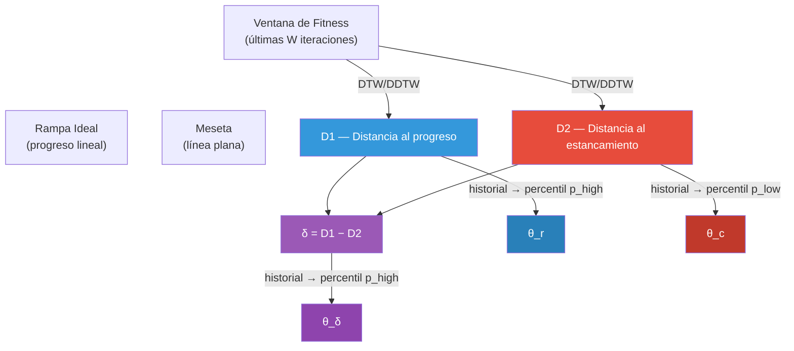
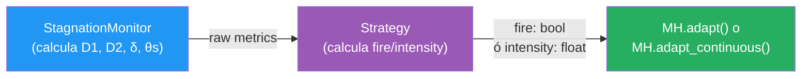

# Análisis de Estrategias de Adaptación basadas en DTW

## Contexto: Los 6 parámetros del DTW

Después del warm-up, en **cada iteración** el monitor entrega:

| # | Métrica | Tipo | Qué mide |
|---|---------|------|----------|
| 1 | `D1` | Medición | Distancia DTW de la ventana de fitness a la **rampa ideal** (progreso) |
| 2 | `D2` | Medición | Distancia DTW de la ventana de fitness a la **meseta** (estancamiento) |
| 3 | `delta` | Medición derivada | `D1 - D2`. Balance progreso/estancamiento |
| 4 | `theta_c` | Umbral adaptativo | Percentil bajo del historial de D2 → "qué es normal para D2" |
| 5 | `theta_r` | Umbral adaptativo | Percentil alto del historial de D1 → "qué es normal para D1" |
| 6 | `theta_delta` | Umbral adaptativo | Percentil alto del historial de delta → "qué es normal para delta" |

Además, hay un contador auxiliar:
- `no_improve_len`: iteraciones consecutivas sin mejora (no es DTW, es un contador simple)

---

## Relaciones entre las métricas



> [!IMPORTANT]
> Los thetas son **auto-normalizadores**: se adaptan al rango real de cada métrica en esta corrida, con este problema y esta MH. Esto los hace ideales para construir **ratios comparables** como `D1/θ_r` o `δ/θ_δ`.

---

## Los 3 ratios normalizados disponibles

Estas son las unidades "limpias" que se pueden construir a partir de los 6 params:

```
r_estancamiento = D2 / (θ_c + ε)
  → < 1: la curva es MÁS plana que lo habitual → estancado
  → > 1: la curva es MENOS plana que lo habitual → activo

r_progreso = D1 / (θ_r + ε)
  → < 1: progresando MEJOR que lo habitual
  → > 1: progresando PEOR que lo habitual

r_balance = δ / (θ_δ + ε)
  → < 0: progreso neto
  → 0-1: estancamiento leve a moderado
  → > 1: estancamiento severo (peor que el 70% histórico)
```

---

## Estrategias propuestas (de más simple a más compleja)

### Familia A: Booleanas (discretas — sí/no)

Todas mantienen la interfaz actual `adapt(fire: bool)`. El cambio está en **cómo se calcula `fire`**, no en cómo actúa la MH.

---

#### A1. Delta puro (la más simple posible)

```
fire = delta > 0
```

Usa UN solo parámetro. Sin paciencia, sin plateau.

| Pro | Contra |
|-----|--------|
| Trivial de implementar | Extremadamente ruidoso. Oscila constantemente |
| Fácil de explicar en el paper | No tiene filtro anti-ruido |

**Hipótesis**: Funciona pésimo solo, pero es la **baseline** mínima para comparar.

---

#### A2. Delta + theta (actual simplificado)

```
fire = delta >= theta_delta
```

Usa 2 parámetros (`delta`, `theta_delta`). Sin plateau ni paciencia.

| Pro | Contra |
|-----|--------|
| Auto-normalizado (θ_δ adapta la escala) | Sigue sin filtro temporal |
| Captura "peor que lo habitual" | Puede oscilar en zonas de transición |

**Hipótesis**: Mejor que A1 porque θ_δ da contexto histórico, pero sigue siendo reactivo.

---

#### A3. D2 puro ("¿estás estancado? sí o no")

```
fire = D2 <= theta_c
```

Usa 2 parámetros (`D2`, `theta_c`). No mira progreso, solo estancamiento.

| Pro | Contra |
|-----|--------|
| La pregunta más directa: "¿la curva es plana?" | No distingue si la meseta es por convergencia al óptimo o por trampa local |
| D2 bajo = evidencia fuerte de estancamiento | Un plateau breve (2-3 iters) puede disparar falso |

**Hipótesis**: Podría ser sorprendentemente bueno para MHs que hacen mesetas largas.

---

#### A4. Actual — 3 condiciones + patience (baseline)

```
cond_plateau:  no_improve_len >= plateau_max
cond_constant: D2 <= theta_c
cond_ramp:     D1 >= theta_r OR delta >= theta_delta

fire = (las 3 AND durante patience iteraciones consecutivas)
```

Usa los 6 parámetros DTW + `no_improve_len` + `patience`. Es lo que ya tenemos.

| Pro | Contra |
|-----|--------|
| Muy robusto contra falsos positivos | Conservador, puede tardar en reaccionar |
| 2 barreras anti-ruido (plateau + patience) | 8+ hiperparámetros para calibrar |

**Referencia**: Esta es la línea base contra la que medimos todo.

---

#### A5. Ratio normalizado + patience

```
fire = (r_balance > 1.0) durante patience iteraciones consecutivas
```

Donde `r_balance = delta / (theta_delta + eps)`.

Usa 3 parámetros DTW (`delta`, `theta_delta`, `patience`). Es un A2 con filtro temporal.

| Pro | Contra |
|-----|--------|
| Menos hiperparámetros que A4 | Pierde la confirmación de D2 (cond_constant) |
| Auto-normalizado + suavizado temporal | Más simple, quizás menos preciso |

**Hipótesis**: El sweet spot entre simplicidad y robustez.

---

### Familia B: Continuas (el DTW como regulador, no como interruptor)

Cambian la interfaz: en vez de `adapt(fire: bool)` usan `adapt_continuous(intensity: float)` donde `intensity ∈ [0, 1]` interpola suavemente entre parámetros de exploit y explore.

> [!WARNING]
> Requieren modificar `BaseMH` para agregar un nuevo método `adapt_continuous(intensity)` y cada MH necesita implementar la interpolación. Es un cambio arquitectónico no trivial.

---

#### B1. Sigmoid sobre delta (la más directa)

```python
# intensity ∈ [0, 1]
# 0 = puro exploit, 1 = puro explore
raw = delta / (theta_delta + eps)        # normalizado ~[-2, 3]
intensity = 1 / (1 + exp(-k * (raw - center)))  # sigmoid
```

Donde `k` controla la pendiente y `center` el punto de inflexión (típicamente 0 o 1).

La MH interpola sus parámetros:
```python
# PSO ejemplo:
w  = w_exploit  + intensity * (w_explore  - w_exploit)    # 0.729 → 0.9
c1 = c1_exploit + intensity * (c1_explore - c1_exploit)   # 1.49  → 2.5
c2 = c2_exploit + intensity * (c2_explore - c2_exploit)   # 1.49  → 0.5
```

| Pro | Contra |
|-----|--------|
| Transición suave, sin saltos | 2 hiperparámetros nuevos (k, center) |
| El DTW "dosifica" la exploración | Más difícil de visualizar y explicar |
| Evita el problema de oscilación on/off | La sigmoid puede saturar (0 o 1 puro) |

**Hipótesis**: Debería dar convergencia más estable que las versiones booleanas.

---

#### B2. Sigmoid dual: r_progreso + r_estancamiento

```python
# Combinar ambas señales
s_progress   = 1 / (1 + exp(-k1 * (r_progreso - 1)))       # ↑ cuando progreso empeora
s_stagnation = 1 / (1 + exp(-k2 * (1 - r_estancamiento)))   # ↑ cuando estancamiento crece

intensity = alpha * s_progress + (1 - alpha) * s_stagnation
intensity = clip(intensity, 0, 1)
```

Usa D1, D2, θ_r, θ_c por separado en vez de combinarlos en delta.

| Pro | Contra |
|-----|--------|
| Usa la información más rica (D1 y D2 independientes) | 4 hiperparámetros (k1, k2, alpha, center) |
| Puede ponderar progreso vs estancamiento | Más complejo de calibrar |
| Conceptualmente más fuerte en el paper | Difícil justificar alpha sin ablación |

**Hipótesis**: Más expresivo, pero la complejidad puede no justificarse si B1 ya funciona.

---

#### B3. D2 directo como intensidad (la más limpia)

```python
intensity = 1 - clip(D2 / (theta_c * scale + eps), 0, 1)
# D2 bajo (estancado) → intensity alto → explore
# D2 alto (activo)    → intensity bajo → exploit
```

Un solo ratio invertido. `scale` controla qué tan rápido escala.

| Pro | Contra |
|-----|--------|
| UN parámetro extra (scale) | Ignora completamente el progreso (D1) |
| Fácil de explicar: "cuanto más plana la curva, más explora" | Si D2 es bajo pero la MH está convergiendo al óptimo, fuerza exploración innecesaria |
| La señal más directa de estancamiento |  |

**Hipótesis**: Elegante y potente para problemas donde D2 bajo = trampa segura.

---

## Resumen comparativo

| Estrategia | Params DTW usados | Tipo | Hiperparams extra | Complejidad | Novedad paper |
|:----------:|:-----------------:|:----:|:-----------------:|:-----------:|:-------------:|
| A1 | δ | bool | 0 | ⭐ | Baja |
| A2 | δ, θ_δ | bool | 0 | ⭐ | Baja |
| A3 | D2, θ_c | bool | 0 | ⭐ | Media |
| **A4** | **todos + plateau** | **bool** | **plateau, patience** | ⭐⭐⭐ | **Baseline** |
| A5 | δ, θ_δ | bool | patience | ⭐⭐ | Media |
| B1 | δ, θ_δ | continuo | k, center | ⭐⭐⭐ | **Alta** |
| B2 | D1, D2, θ_r, θ_c | continuo | k1, k2, α | ⭐⭐⭐⭐ | **Alta** |
| B3 | D2, θ_c | continuo | scale | ⭐⭐ | **Alta** |

---

## Recomendación para el paper

> [!TIP]
> Para un paper científico con impacto, la estructura narrativa ideal sería:
>
> 1. **A4** (baseline actual) — "Esta es la versión completa con 3 condiciones booleanas"
> 2. **A3 o A5** (simplificación booleana) — "Se puede simplificar significativamente sin perder rendimiento"
> 3. **B1 o B3** (versión continua) — "El paso natural: de switch discreto a regulador continuo"
>
> Esto cuenta una historia de **evolución progresiva**: complejo → simplificado → continuo.

La pregunta que queda abierta es: **¿Cuántas variantes querés comparar experimentalmente?**

Si son 2 enfoques como dijiste al principio:
- **Bool**: A4 (actual) vs una simplificación (A3 o A5)
- **Continuo**: B1 (sigmoid sobre delta normalizado) es la más directa y narrativamente fuerte

Si querés 3 para la tabla del paper: A4 + A5 + B1 es el combo más limpio.

---

## Impacto arquitectónico

### Para las Familia A (booleanas)
No cambia nada en `BaseMH` ni en las 4 MHs. Solo cambia la **lógica dentro del monitor** (o se crea un wrapper/strategy pattern que decide `fire`).

### Para la Familia B (continuas)
Se necesita:
1. Agregar `adapt_continuous(intensity: float)` a `BaseMH`
2. Cada MH implementa la interpolación entre sus parámetros exploit/explore
3. El runner pasa el `intensity` calculado en vez del `fire` booleano
4. Esto es **backward compatible**: `adapt(fire: bool)` sigue existiendo para las variantes A



El `StagnationMonitor` NO cambia. Lo que cambia es la **capa de decisión** entre el monitor y la MH.
