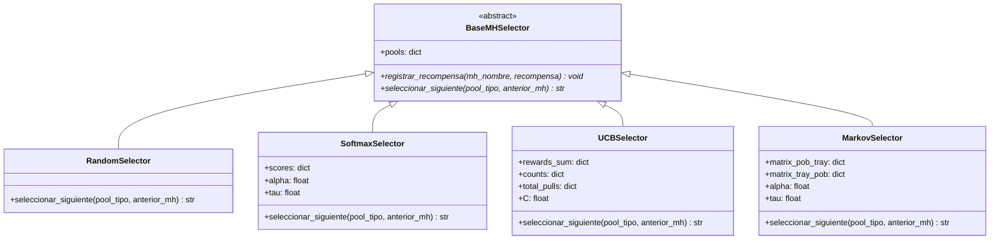

# Propuesta Técnica: Esquemas de Selección Probabilística para la Rotación de Metaheurísticas en el MKP

Este informe describe el diseño técnico, la formulación matemática y la estrategia de evaluación de los nuevos **esquemas de selección probabilística (Adaptive Operator Selection - AOS)** para el orquestador híbrido de rotación de metaheurísticas aplicado al Problema de la Mochila Multidimensional (MKP). El objetivo de esta extensión es dotar al orquestador de inteligencia adaptativa para seleccionar dinámicamente los algoritmos de búsqueda más eficientes, sirviendo como núcleo metodológico para un artículo científico de alto impacto.

---

## 1. Motivación y Justificación Científica

En el pipeline actual, la alternancia entre metaheurísticas poblacionales (exploración) y de trayectoria (explotación) se realiza mediante una selección uniforme aleatoria. Si bien este enfoque simple proporciona un marco de comparación neutro, ignora que:
1. **Diferencias de rendimiento:** Algunos algoritmos pueden desempeñarse significativamente mejor que otros según las características de la instancia (dimensión, densidad de restricciones).
2. **Dependencia temporal:** Un algoritmo explorador (como el GA) puede ser muy valioso al inicio de la búsqueda para encontrar zonas óptimas, pero perder efectividad frente a otros (como el PSO o GWO) en fases avanzadas.
3. **Sinergias de secuencia:** La calidad de la búsqueda de trayectoria (ej. Tabu Search) depende críticamente de la diversidad y del óptimo local sembrado por el algoritmo poblacional precedente.

La incorporación de selectores adaptativos basados en aprendizaje por refuerzo y teoría de bandidos multibrazo permite al orquestador **aprender en tiempo real** qué algoritmos producen los mejores avances con el menor consumo de tiempo, optimizando dinámicamente la asignación de recursos computacionales.

---

## 2. Formulación de los Esquemas de Selección

Definimos el conjunto de algoritmos disponibles en cada fase como:
*   $\mathcal{P}_{\text{pob}} = \{ \text{GA}, \text{PSO}, \text{GWO}, \text{EHO}, \text{WOA} \}$ (Pool Poblacional)
*   $\mathcal{P}_{\text{tray}} = \{ \text{SA}, \text{TS}, \text{ILS} \}$ (Pool de Trayectoria)

### A. Definición de la Recompensa ($R_a(t)$)
Para evaluar la efectividad de una metaheurística $a$ ejecutada en el turno $t$, definimos una métrica de **recompensa basada en eficiencia de fitness**:

$$R_a(t) = \frac{f_{\text{final}} - f_{\text{inicial}}}{f_{\text{inicial}} \cdot \Delta t_a + \epsilon}$$

Donde:
*   $f_{\text{inicial}}$ es el mejor fitness global antes del turno de la MH $a$.
*   $f_{\text{final}}$ es el mejor fitness global después del turno de la MH $a$.
*   $\Delta t_a$ es el tiempo en segundos que duró la ejecución del turno de la MH $a$ (duración hasta el estancamiento determinado por el monitor DTW).
*   $\epsilon = 10^{-6}$ es una constante para evitar divisiones por cero.

*Nota:* Si un algoritmo no mejora el óptimo global durante su turno ($f_{\text{final}} = f_{\text{inicial}}$), su recompensa es exactamente $R_a(t) = 0$. Esto penaliza el uso ineficaz del tiempo de cómputo.

---

### B. Esquema 1: Ruleta Dinámica basada en Softmax (Softmax Selector)
Este esquema asigna a cada metaheurística $a$ una puntuación acumulada $S_a$ que se actualiza en cada turno mediante una media móvil exponencial (EMA).

1.  **Actualización de Puntuación:**
    $$S_a \leftarrow (1 - \alpha) S_a + \alpha R_a(t)$$
    Donde $\alpha \in [0, 1]$ es el factor de aprendizaje (learning rate) que determina la memoria del selector. Un valor típico es $\alpha = 0.3$.
2.  **Cálculo de Probabilidad de Selección:**
    La probabilidad de seleccionar la metaheurística $a$ de su respectivo pool $\mathcal{P}$ es:
    $$P(a) = \frac{e^{S_a / \tau}}{\sum_{j \in \mathcal{P}} e^{S_j / \tau}}$$
    Donde $\tau > 0$ es el parámetro de temperatura:
    *   Si $\tau \to \infty$, las probabilidades tienden a ser uniformes (comportamiento aleatorio).
    *   Si $\tau \to 0$, la selección se vuelve determinista, eligiendo siempre la MH con mayor puntuación acumulada.

---

### C. Esquema 2: Bandido Multibrazo con Confianza Superior (UCB Selector)
Basado en el algoritmo UCB-1, este esquema equilibra la explotación (elegir la metaheurística con mejor promedio de recompensa histórico) y la exploración (elegir metaheurísticas que han sido poco seleccionadas).

1.  **Regla de Selección:**
    En cada turno, se selecciona la metaheurística $a$ que maximiza la siguiente expresión en su pool $\mathcal{P}$:
    $$UCB_a = \bar{R}_a + C \cdot \sqrt{\frac{\ln N}{N_a}}$$
    Donde:
    *   $\bar{R}_a$ es la recompensa promedio obtenida por la MH $a$ en todas sus ejecuciones previas.
    *   $N$ es el número total de switches (turnos) ejecutados en el pool actual.
    *   $N_a$ es el número de veces que se ha seleccionado la MH $a$.
    *   $C > 0$ es el coeficiente de exploración que controla la importancia otorgada a la incertidumbre (un valor estándar es $C = 0.5$).
2.  **Inicialización:**
    Si un algoritmo no ha sido seleccionado ($N_a = 0$), se establece $UCB_a = \infty$, garantizando que todas las metaheurísticas sean probadas al menos una vez al comienzo del pipeline.

---

### D. Esquema 3: Selección Markoviana basada en Éxito (Markov Selector)
Este esquema modela las transiciones entre fases como un proceso de Markov de primer orden, asumiendo que el éxito de una MH de trayectoria depende del algoritmo poblacional que generó su solución de entrada (y viceversa).

1.  **Matrices de Recompensa:**
    Mantenemos dos matrices de pesos de transición:
    *   $W_{\text{pob} \to \text{tray}} \in \mathbb{R}^{|\mathcal{P}_{\text{pob}}| \times |\mathcal{P}_{\text{tray}}|}$
    *   $W_{\text{tray} \to \text{pob}} \in \mathbb{R}^{|\mathcal{P}_{\text{tray}}| \times |\mathcal{P}_{\text{pob}}|}$
2.  **Actualización de Pesos:**
    Si la MH poblacional $i$ le pasa la solución a la MH de trayectoria $j$, y esta última obtiene una recompensa $R_j(t)$, actualizamos el peso de la transición correspondiente:
    $$W_{\text{pob} \to \text{tray}}[i][j] \leftarrow (1 - \alpha) W_{\text{pob} \to \text{tray}}[i][j] + \alpha R_j(t)$$
    Análogamente se actualiza la matriz contraria al pasar de trayectoria a poblacional.
3.  **Probabilidad de Transición:**
    La probabilidad de seleccionar la MH de trayectoria $j$ habiendo ejecutado previamente la MH poblacional $i$ es:
    $$P(j \mid i) = \frac{e^{W_{\text{pob} \to \text{tray}}[i][j] / \tau}}{\sum_{k \in \mathcal{P}_{\text{tray}}} e^{W_{\text{pob} \to \text{tray}}[i][k] / \tau}}$$

---

## 3. Arquitectura del Módulo Propuesto

Se propone encapsular toda la lógica de selección en un nuevo archivo `hybrid_mkp/selectors.py`. El diagrama de clases es el siguiente:



### Integración en el Orquestador (`orchestrator.py`)
En el archivo `hybrid_mkp/orchestrator.py`, la función `ejecutar_pipeline` se modificará para aceptar una instancia del selector:

```python
def ejecutar_pipeline(
    inst: MKPInstance,
    tiempo_max: float = 120.0,
    stag_cfg: StagnationConfig | None = None,
    pop_injection_mode: str = "mixed",
    selector: BaseMHSelector | None = None,   # NUEVO PARÁMETRO
    verbose: bool = True,
) -> PipelineResult:
    if selector is None:
        selector = RandomSelector(POOL_POBLACIONAL, POOL_TRAYECTORIA)
    
    # ...
    # En el bucle principal de ejecución:
    mh = selector.seleccionar_siguiente(turno, anterior_mh)
    
    # Ejecución de la MH
    resultado = _ejecutar_mh(...)
    
    # Calcular Recompensa
    recompensa = calcular_recompensa(valor_previo, resultado.mejor_valor, duracion)
    
    # Retroalimentación al selector
    selector.registrar_recompensa(mh, recompensa)
    
    # Guardar en logs
    # ...
```

---

## 4. Plan de Pruebas y Benchmark para Publicación

Para validar los esquemas y recolectar los datos para el artículo científico, se desarrollará un nuevo script de benchmark comparativo (`probabilistic_benchmark.py`).

### A. Setup Experimental
*   **Instancias:** Una selección representativa de la OR-Library (e.g., 5 instancias medianas de 100 items y 5 instancias grandes de 250/500 items).
*   **Métricas a Comparar:**
    1.  **Calidad de Solución:** Fitness final y Gap porcentual respecto al óptimo conocido.
    2.  **Velocidad de Convergencia:** Tiempo en segundos empleado para encontrar el mejor fitness global.
    3.  **Tasa de Mejora Eficiente:** Recompensa acumulada promedio durante la ejecución.
    4.  **Estabilidad:** Desviación estándar de los resultados sobre 10 ejecuciones independientes con distintas semillas aleatorias.

### B. Análisis Estadístico (Esencial para Journal)
*   **Test de Wilcoxon Rank-Sum:** Para comparar si la diferencia en la calidad de soluciones de los selectores adaptativos versus el selector aleatorio base es estadísticamente significativa ($p < 0.05$).
*   **Test de Friedman:** Para realizar una comparación múltiple y establecer un ranking formal de los 4 esquemas sobre todo el conjunto de instancias.

### C. Visualización de Resultados
*   **Stacked Area Plot (Evolución de Probabilidad):** Mostrará cómo el selector Softmax redistribuye el peso probabilístico entre GA, PSO, GWO, etc., a medida que transcurren los segundos del pipeline, haciendo explícito qué algoritmo es dominante en cada etapa de la búsqueda.
*   **Boxplots de Desempeño:** Comparación visual del Gap final para cada esquema de selección.
