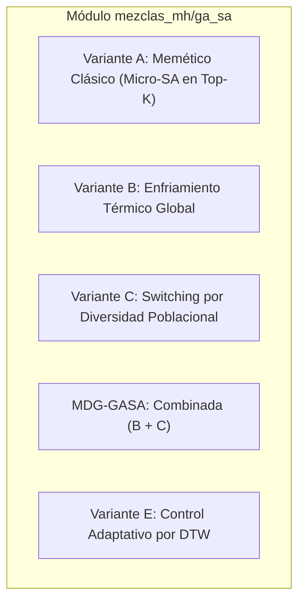

# Variantes de Hibridación GA-SA (Algoritmo Genético + Simulated Annealing)

Este documento detalla la arquitectura, lógica de funcionamiento, ecuaciones limpias y mecanismos de control de las **5 variantes híbridas GA-SA** implementadas en el módulo `mezclas_mh/ga_sa/`.

---

## 1. Contexto y Motivación de la Hibridación

- **Algoritmo Genético (GA):** Destaca por su alta capacidad de **exploración global** y recombinación (crossover), pero es propenso a convergencia prematura y lentitud en el ajuste fino de soluciones individuales.
- **Simulated Annealing (SA):** Destaca por su excelente capacidad de **explotación local y escape probabilístico de óptimos locales** mediante el criterio de aceptación de Metrópolis (P = exp(-Delta / T)), pero está limitado por operar sobre una única trayectoria.
- **Objetivo de las Mezclas:** Construir algoritmos meméticos de alto rendimiento que combinen la recombinación poblacional de GA con la capacidad térmica de escape y refinamiento de SA.

---

## 2. Descripción Detallada por Variante



---

### Variante A: Algoritmo Memético Clásico (`variante_a.py`)

#### Concepto
Ejecuta selección, cruce y mutación estándar del GA. Posteriormente, aplica un ciclo corto de **Micro-SA** sobre los Top-K mejores individuos de la población para realizar refinamiento local antes de reinsertarlos.

#### Ecuaciones y Micro-SA:
```text
Delta = Fitness(sol_vecino) - Fitness(sol_actual)

En Maximización (MKP):
  Si Delta >= 0: Aceptar vecino incondicionalmente
  Si Delta < 0:  Aceptar con probabilidad P = exp(Delta / T_local)

En Minimización (Continuo / HRES / Hypertuning):
  Si Delta <= 0: Aceptar vecino incondicionalmente
  Si Delta > 0:  Aceptar con probabilidad P = exp(-Delta / T_local)
```

---

### Variante B: Enfriamiento Térmico Global (`variante_b.py`)

#### Concepto
Un programa de enfriamiento geométrico global gobierna todas las probabilidades del GA a lo largo de las generaciones.

#### Ecuaciones Clave:
1. **Programa de Enfriamiento Global:**
```text
T(t) = T_inicial * (T_final / T_inicial) ** (t / MaxGen)
```

2. **Tasa de Mutación Térmica:**
```text
p_m(t) = p_m_min + (p_m_max - p_m_min) * (T(t) / T_inicial)
```

3. **Reemplazo Poblacional por Metrópolis:**
Los hijos peores que sus progenitores son aceptados probabilísticamente para ingresar a la población si:
```text
random(0, 1) < exp(-Delta / T(t))
```

---

### Variante C: Switching Dinámico por Diversidad Poblacional (`variante_c.py`)

#### Concepto
Mide dinámicamente la dispersión espacial del enjambre frente a su centroide y conmuta el régimen de búsqueda según el estado de la población.

#### Ecuaciones Clave:
1. **Centroide:**
```text
X_mean(t) = (1 / N_pop) * Sumatorio(X_i(t))
```

2. **Diversidad Normalizada:**
```text
Div(t) = (1 / N_pop) * Sumatorio(|| X_i(t) - X_mean(t) ||)
Div_norm(t) = Div(t) / Div(0)
```

3. **Umbral Dinámico:**
```text
umbral(t) = umbral_init * (1 - t / MaxGen) + umbral_final * (t / MaxGen)
```

#### Regla de Conmutación:
- **Si Div_norm(t) <= umbral(t):** Población sobre-agrupada -> Activa **SA Multi-Agente a Alta Temperatura** para dispersar y romper estancamiento.
- **Si Div_norm(t) > umbral(t):** Buena diversidad -> Ejecuta **GA estándar** (cruce y mutación).

---

### MDG-GASA: Momentum Diversity-Guided GA-SA (`mdg_gasa.py`)

#### Concepto
Es la **variante integrada completa (B + C)**:
- Utiliza la **diversidad poblacional (Var C)** para detectar el déficit de dispersión.
- Utiliza la **temperatura adaptativa y el criterio de Metrópolis (Var B)** para regular la intensidad de las perturbaciones y la aceptación de soluciones.

---

### Variante E: DTW-Adaptive GA-SA (`variante_e_dtw.py`)

#### Concepto
Un monitor **DTW (Dynamic Time Warping)** evalúa en tiempo real la serie temporal de fitness de los últimos pasos.

#### Mecanismos Adaptativos:
1. **Thermal Reheating:** Si `Delta_DTW < theta_delta` (desaceleración), inyecta un pulso de calor a las mejores soluciones para sacudirlas.
2. **Annealing Blast:** Ante alerta crítica de estancamiento (`fire == True`), preserva al mejor individuo y reinicializa térmicamente el 40% peor de la población.

---

## 3. Cuadro Comparativo Resumen

| Variante | Archivo | Mecanismo de Control | Rol del GA | Rol del SA |
| :--- | :--- | :--- | :--- | :--- |
| **Variante A** | `variante_a.py` | Fijo por generación | Búsqueda global | Micro-SA en Top-K élites |
| **Variante B** | `variante_b.py` | Temperatura decreciente T(t) | Selección y recombinación | Modula mutación y aceptación de peores |
| **Variante C** | `variante_c.py` | Diversidad Div_norm vs Umbral(t) | Recombinación cuando hay diversidad | Dispersión térmica cuando se agrupa |
| **MDG-GASA** | `mdg_gasa.py` | Diversidad + Temperatura | Cruce térmico guiado | Filtro de Metrópolis en reemplazo |
| **Variante E** | `variante_e_dtw.py` | Delta DTW vs theta_delta | Operación normal en progreso | Thermal Reheating y Annealing Blast |

---

## 4. Estructura del Módulo

```text
mezclas_mh/ga_sa/
├── README_VARIANTES.md                  # Documentación teórica y ecuaciones
├── __init__.py                          # Exportación de clases y funciones
├── benchmark_ga_sa.py                   # Script de benchmark (MKP + CEC2022)
└── algoritmos/
    ├── __init__.py                      # Subpaquete de algoritmos
    ├── variante_a.py                    # Memético Clásico
    ├── variante_b.py                    # Annealing-Guided Global
    ├── variante_c.py                    # Switching por Diversidad
    ├── mdg_gasa.py                      # Combinada B + C
    └── variante_e_dtw.py                # DTW-Adaptive
```
