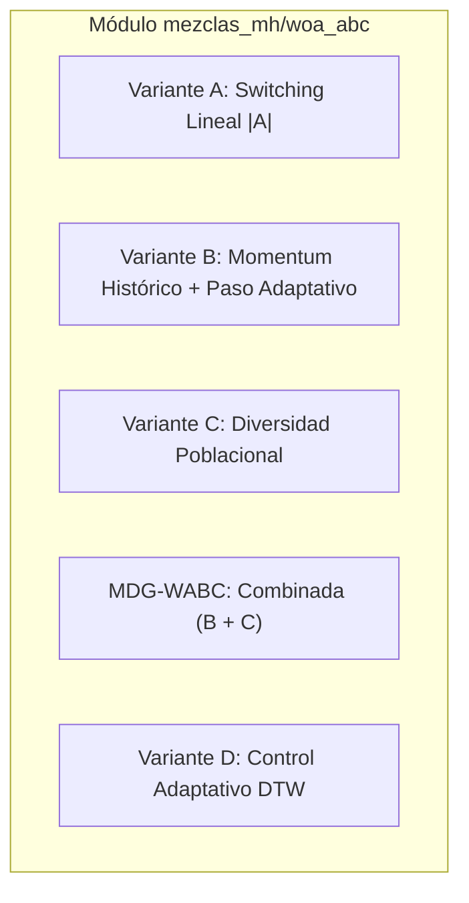
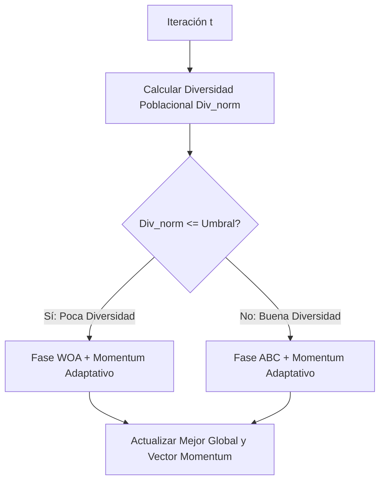

# Variantes de Hibridación WOA-ABC (Whale Optimization + Artificial Bee Colony)

Este documento detalla la arquitectura, lógica de funcionamiento, ecuaciones limpias, ejemplos numéricos y mecanismos de switching de las **5 variantes híbridas** implementadas en el módulo `mezclas_mh/woa_abc/`.

---

## 1. Contexto y Motivación de la Hibridación

- **Whale Optimization Algorithm (WOA):** Destaca por su alta capacidad de **exploración global** mediante movimientos de cerco con vectores de coeficiente A y la búsqueda en espiral logarítmica alrededor de la mejor solución encontrada. Sin embargo, puede sufrir de convergencia lenta o estancamiento en fases tardías de explotación fina.
- **Artificial Bee Colony (ABC):** Destaca por su excelente capacidad de **explotación local y búsqueda en vecindarios** a través de las abejas empleadas y observadoras, además de poseer un mecanismo de escape de óptimos locales mediante las abejas exploradoras (scouts).
- **Objetivo de las Mezclas:** Combinar la capacidad exploratoria de WOA con el refinamiento y escape de ABC para resolver de forma balanceada tanto problemas continuos (**CEC 2022**) como discretos (**MKP** vía binarización LB2 y reparación greedy).

---

## 2. Descripción Detallada por Variante



---

### Variante A: Conmutación Determinista por Coeficiente |A| (`variante_a.py`)

#### Concepto
Utiliza el parámetro natural de decaimiento lineal a(t) de WOA para dividir la optimización en dos regímenes estrictos: una fase inicial de exploración global seguida de una fase final de refinamiento local.

#### Mecanismo y Ecuaciones
En cada iteración t, se calcula:

```text
a(t) = 2 - 2 * (t / MaxIt)
A = 2 * a(t) * r - a(t)       (donde r es un vector aleatorio en [0, 1])
```

#### Criterio de Switching:
- **Si |A| >= 1 (Fase Temprana - Exploración):**
  Se ejecutan los operadores de movimiento de **WOA**:
  - Si p < 0.5 y |A| >= 1: Búsqueda de presa aleatoria (Exploración global).
  - Si p >= 0.5: Movimiento en espiral logarítmica hacia la mejor ballena.
- **Si |A| < 1 (Fase Tardía - Explotación):**
  Se transfieren todas las posiciones a la lógica de **ABC**, ejecutando las 3 fases:
  1. *Abejas Empleadas:* Modificación local de vecindario:
     ```text
     v[i, j] = x[i, j] + phi * (x[i, j] - x[k, j])    con phi en [-1, 1]
     ```
  2. *Abejas Observadoras:* Selección por ruleta proporcional al fitness y búsqueda local.
  3. *Abejas Exploradoras:* Reinicialización si trials[i] >= limit.

---

### Variante B: Momentum-Guided con Paso Adaptativo (`variante_b.py`)

#### Concepto
Introduce **memoria histórica de la trayectoria** recorrida por la mejor solución global para acelerar la convergencia y guiar a las partículas en la dirección óptima mediante un vector de Momentum y una tasa de paso con decaimiento exponencial.

#### Ecuaciones Clave:

1. **Vector de Momentum Histórico:**
```text
Momentum(t) = BestPos(t - 1) - BestPos(t - 2)
```

2. **Paso Adaptativo Exponencial:**
```text
step(t) = step_init * (step_final / step_init) ** (t / MaxIt)
```

3. **Actualización de Movimiento (WOA + Momentum):**
```text
X_new = X_WOA + step(t) * beta * Momentum(t)
```

4. **Actualización de Búsqueda (ABC + Momentum):**
```text
v[i, j] = x[i, j] + phi * (x[i, j] - x[k, j]) + step(t) * beta * Momentum[j](t)
```

---

### Ejemplo Numérico Paso a Paso de la Variante B (Dimensión D = 2)

Supongamos que estamos optimizando una función con:
- MaxIt = 100 iteraciones
- beta = 0.5 (peso del momentum)
- step_init = 1.0 (paso al inicio)
- step_final = 0.1 (paso al final)

#### Paso 1: Calcular el Vector de Momentum
Supón que en las últimas dos iteraciones el mejor individuo global estuvo en:
- Mejor posición en t - 2: BestPos(t - 2) = [10.0, 5.0]
- Mejor posición en t - 1: BestPos(t - 1) = [14.0, 8.0]

```text
Momentum(t) = BestPos(t - 1) - BestPos(t - 2)
Momentum(t) = [14.0 - 10.0, 8.0 - 5.0] = [4.0, 3.0]
```

#### Paso 2: Calcular el Paso Adaptativo step(t) en la iteración t = 50 (mitad del proceso)
```text
step(50) = 1.0 * (0.1 / 1.0) ** (50 / 100)
step(50) = 1.0 * (0.1) ** 0.5 = 0.316
```

El vector de empuje direccional es:
```text
Empuje = step(t) * beta * Momentum(t)
Empuje = 0.316 * 0.5 * [4.0, 3.0] = [0.632, 0.474]
```

#### Paso 3: Aplicación en Movimiento WOA (Ballenas)
Si una ballena calcula su nueva posición estándar de WOA en X_WOA = [12.0, 7.0]:
```text
X_new = X_WOA + Empuje
X_new = [12.0, 7.0] + [0.632, 0.474] = [12.632, 7.474]
```

#### Paso 4: Aplicación en Búsqueda ABC (Abejas)
Si una abeja obrera está en x_i = [11.0, 6.0], vecina x_k = [9.0, 4.0] y phi = 0.4:
- Movimiento estándar ABC (dimensión 1):
  ```text
  v_ABC[1] = 11.0 + 0.4 * (11.0 - 9.0) = 11.8
  ```
- Con la Variante B sumamos el momentum (0.632):
  ```text
  v_final[1] = 11.8 + 0.632 = 12.432
  ```

---

### Variante C: Switching Dinámico por Diversidad Poblacional (`variante_c.py`)

#### Concepto
En lugar de depender del tiempo o del número de iteración, el algoritmo mide dinámicamente la **dispersión espacial de la población** respecto a su centroide. Esto permite alternar entre exploración y explotación según el estado real del enjambre.

#### Ecuaciones Clave:

1. **Centroide Poblacional:**
```text
X_mean(t) = (1 / N_pop) * Sumatorio(X_i(t))
```

2. **Diversidad Poblacional (Distancia Euclidiana Media):**
```text
Div(t) = (1 / N_pop) * Sumatorio(|| X_i(t) - X_mean(t) ||)
```

3. **Diversidad Normalizada:**
```text
Div_norm(t) = Div(t) / Div(0)
```

4. **Umbral Dinámico Lineal:**
```text
umbral(t) = umbral_init * (1 - t / MaxIt) + umbral_final * (t / MaxIt)
```

#### Lógica de Decisión:
- **Si Div_norm(t) <= umbral(t):**
  La población está sobre-agrupada o en riesgo de estancamiento -> Se ejecuta **WOA** para dispersar las posiciones y reabrir la exploración.
- **Si Div_norm(t) > umbral(t):**
  La población tiene suficiente diversidad -> Se ejecuta **ABC** para enfocar el esfuerzo en explotación y refinamiento local.

---

### MDG-WABC: Momentum Diversity-Guided WOA-ABC (`mdg_wabc.py`)

#### Concepto
Es la **variante integrada completa (B + C)**:
- Utiliza el **control de diversidad poblacional (Variante C)** para decidir **CUÁNDO** conmutar entre WOA y ABC.
- Aplica el **guiado por momentum histórico (Variante B)** para orientar **HACIA DÓNDE** deben desplazarse los agentes en ambas fases.



---

### Variante D: DTW-Adaptive WOA-ABC (`variante_d_dtw.py`)

#### Concepto
Utiliza un monitor de **Dynamic Time Warping (DTW / DDTW)** en tiempo real que evalúa la forma de la curva de convergencia de los últimos W pasos frente a patrones sintéticos de *Rampa* (progreso activo) y *Constante* (meseta/estancamiento).

#### Mecanismos Adaptativos Internos:

1. **Conmutación Dirigida por DTW:**
   - **Si Delta_DTW >= theta_delta (Progreso Activo):**
     Ejecuta **WOA** (exploración activa).
   - **Si Delta_DTW < theta_delta (Desaceleración / Meseta):**
     Conmuta a **ABC** (explotación minuciosa).

2. **Amplificación Dinámica de Momentum:**
   - Cuando Delta_DTW disminuye (se acerca a una meseta), el factor beta de momentum se amplifica automáticamente para inyectar energía y empujar a las partículas fuera de pozos de atracción.

3. **DTW Scout Rescue (Mecanismo de Rescate):**
   - Si el monitor DTW emite una alerta crítica de estancamiento prolongado (`fire == True`), se ejecuta un reinicio inteligente: se preserva al mejor individuo global y se reinicializa aleatoriamente el **30% peor** de la colonia para restaurar variabilidad sin perder el óptimo acumulado.

---

## 3. Cuadro Comparativo Resumen

| Variante | Archivo | Mecanismo de Switching | Guiado Direccional | Mecanismo Anti-Estancamiento |
| :--- | :--- | :--- | :--- | :--- |
| **Variante A** | `variante_a.py` | Parámetro |A| (Determinista por iteración) | Estándar | Scouts de ABC |
| **Variante B** | `variante_b.py` | Fases combinadas por iteración | Momentum Histórico: BestPos(t-1) - BestPos(t-2) | Decaimiento exponencial de paso |
| **Variante C** | `variante_c.py` | Diversidad Poblacional vs Umbral dinámico | Estándar | Activación forzada de WOA al agruparse |
| **MDG-WABC** | `mdg_wabc.py` | Diversidad Poblacional (Var C) | Momentum Histórico (Var B) | WOA + Scouts + Momentum |
| **Variante D** | `variante_d_dtw.py` | Delta DTW vs Umbral adaptativo theta_delta | Momentum escalado por distancia DTW | DTW Scout Rescue (reinicio del 30% peor) |

---

## 4. Ejecución del Benchmark

Para comparar el rendimiento de todas las variantes bajo las mismas condiciones:

```bash
# Ejecutar suite completa (MKP + CEC2022)
python -m mezclas_mh.woa_abc.benchmark_woa_abc
```
Los resultados se almacenan automáticamente en `resultados/mezclas_mh/woa_abc/run_<TIMESTAMP>/` organizados en carpetas `mkp/` y `cec2022/` con gráficos de convergencia, boxplots comparativos y tablas `.csv` / `.md`.
