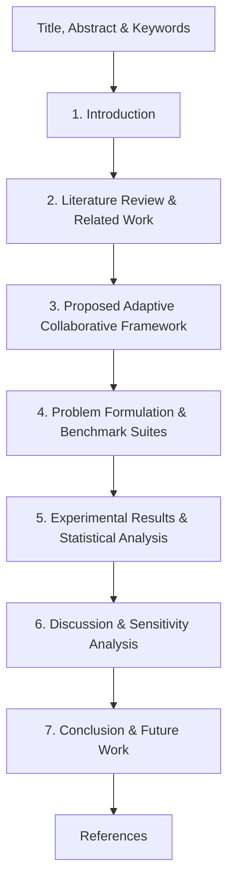

# Estructura Maestra para Artículo Científico Q1 (Journal Guide)

**Título del Artículo:**  
*A Dynamic Time Warping-Driven Adaptive Collaborative Metaheuristic Framework for Discrete, Continuous, and Renewable Energy System Optimization*

**Revistas Objetivo Q1 recomendadas:**
- *Swarm and Evolutionary Computation* (Elsevier, Q1, IF ~ 8.2)
- *Applied Soft Computing* (Elsevier, Q1, IF ~ 7.2)
- *IEEE Transactions on Evolutionary Computation* (IEEE, Q1, IF ~ 14.3)
- *Knowledge-Based Systems* (Elsevier, Q1, IF ~ 7.6)
- *Energy Conversion and Management* (Elsevier, Q1 - para enfoque en HRES2-H2)

---

## ESTRUCTURA SECCIÓN POR SECCIÓN (Q1 Journal Standard)

---

### 1. ABSTRACT (Resumen Estructurado: 200–250 palabras)
El abstract en revistas Q1 debe seguir el esquema estricto de 5 oraciones clave:
1. **Contexto & Motivación:** Relevancia de resolver problemas complejos discretos, continuos e industriales con metaheurísticas.
2. **Planteamiento de la Brecha (Gap):** Deficiencias de las metaheurísticas individuales y de los marcos colaborativos con frecuencias de comunicación fijas ($K$).
3. **Método Propuesto:** Presentación del *Adaptive Collaborative Metaheuristic Framework* gobernado por monitoreo de estancamiento elástico DTW/DDTW e inyección elitista de memoria ($x_{best}$).
4. **Resultados Clave (Cuantitativos):** Mencionar desempeño en MKP (Mknapcb), suite CEC2022 (F1-F12) y microred HRES2-H2 (reducción de LCOE/LCOH), destacando la significación estadística ($p < 0.05$ en test de Wilcoxon y Friedman).
5. **Conclusión / Impacto:** Resaltar la invariancia estructural y generalización multidominio del marco propuesto.

**Keywords (5–6):** Collaborative Metaheuristics; Dynamic Time Warping (DTW); Stagnation Monitoring; Multidimensional Knapsack Problem; CEC2022; Renewable Energy Microgrid (HRES2-H2).

---

### 2. SECTION 1: INTRODUCTION
- **1.1. Context & Motivation:** NFL Theorem, necesidad de cooperación multi-algoritmo.
- **1.2. Problem Statement:** Dilema del control de comunicación ("Cuándo colaborar").
- **1.3. Proposed Solution:** Arquitectura del framework colaborativo guiado por DTW y memoria elitista.
- **1.4. Key Scientific Contributions:** Lista numerada con los 4 aportes principales.
- **1.5. Paper Outline (Roadmap):** Guía de lectura del artículo.

---

### 3. SECTION 2: LITERATURE REVIEW & RELATED WORK
- **2.1. Collaborative & Cooperative Metaheuristics (CM):** Taxonomía (Crainic & Toulouse, El-Abd & Kamel, Alba), mecanismos de intercambio de información e inyección de soluciones.
- **2.2. High-Level Relay Hybrid Metaheuristics (HLRH):** Sinergia entre exploración (poblacional) e intensificación (trayectoria).
- **2.3. Dynamic Time Warping in Time Series Analysis:** Orígenes de DTW/DDTW y su adaptación para series temporales de convergencia.
- **2.4. Benchmark Applications:** Breve revisión de MKP, CEC2022 y optimización tecno-económica de microredes HRES2-H2.
- **2.5. Research Gap Summary:** Tabla comparativa formal (Literaturas Existentes vs. Enfoque Propuesto).

---

### 4. SECTION 3: PROPOSED ADAPTIVE COLLABORATIVE FRAMEWORK
Esta sección debe ser matemáticamente rigurosa para revisión Q1:
- **3.1. Framework Architecture Overview:** Diagrama conceptual completo del flujo de comunicación e inyección de memoria.
- **3.2. DTW-Based Stagnation Monitoring Engine:**
  - Formulación matemática del alineamiento DTW/DDTW entre ventana reciente $Q$ y trayectoria de referencia $R$.
  - Indicadores de pendiente elástica $D_1$ vs $D_2$.
  - Mecanismo de percentiles dinámicos adaptativos ($P_{low}, P_{high}$).
- **3.3. Adaptive Collaborative Protocol & Memory Injection:**
  - Algoritmo de conmutación de solvers.
  - Formulación del operador de inyección elitista de memoria ($x_{best}$) en la población/vector inicial del nuevo solver.
- **3.4. Domain-Adaptive Solver Pools:**
  - Formulación del pool doble (Poblacional $\leftrightarrow$ Trayectoria) para MKP y HRES2-H2.
  - Formulación del pool poblacional puro para CEC2022.
- **3.5. Computational Complexity Analysis:** Análisis asintótico de orden de complejidad ($O(W \cdot K)$ donde la ventana $W \ll N_{iter}$).

---

### 5. SECTION 4: PROBLEM FORMULATION & BENCHMARK SUITES
- **4.1. Discrete Combinatorial Domain: Multidimensional Knapsack Problem (MKP)**
  - Formulación matemática de función objetivo y restricciones matriciales.
  - Instancias de prueba Mknapcb (Chu & Beasley).
- **4.2. Continuous Parametric Domain: IEEE CEC2022 Benchmark Suite**
  - Ecuaciones, límites de búsqueda y características de F1 a F12 (Unimodales, Multimodales, Híbridas y Compuestas).
- **4.3. Real-World Engineering Domain: Green Hydrogen Microgrid System (HRES2-H2)**
  - Modelo matemático de despacho horario ($t = 1 \dots 8,760\text{ h}$).
  - Componentes: Turbina Eólica, Solar PV, Electrolizador, Baterías, Tanque de $H_2$, Celda de Combustible.
  - Funciones objetivo tecno-económicas: LCOE ($/kWh$), LCOH ($/kg$).
  - Restricción crítica: Límite de Excedente de Energía a Red (AGSR $\le 20\%$).

---

### 6. SECTION 5: EXPERIMENTAL RESULTS & STATISTICAL ANALYSIS
- **5.1. Experimental Protocol & Settings:** 31 ejecuciones independientes, semillas fijas, hardware/software specifications.
- **5.2. Performance on MKP Benchmarks:** Tablas comparativas (Mejor, Media, Std) vs solvers aislados y baseline.
- **5.3. Performance on CEC2022 Continuous Benchmark:** 
  - Tablas de métricas descriptivas para F1-F12.
  - Curvas de convergencia logarítmica por época.
- **5.4. Performance on HRES2-H2 Industrial Microgrid:**
  - Resultados de LCOE y LCOH.
  - Diagramas de Gantt de conmutación algorítmica.
  - Gráficos de plano de fase ($D_1$ vs $D_2$).
- **5.5. Rigorous Non-Parametric Statistical Inferential Analysis:**
  - Pruebas de normalidad: Shapiro-Wilk Test ($p < 0.05$).
  - Pruebas por Pares: Wilcoxon Signed-Rank Test & Mann-Whitney U Test (Tablas de $p$-valores y significación).
  - Comparación Múltiple Global: Friedman Rank Test y ranking promedio.

---

### 7. SECTION 6: DISCUSSION & SENSITIVITY ANALYSIS
- **6.1. Insights on Adaptive Collaboration Dynamics:** ¿Por qué la colaboración gatillada por DTW supera a las frecuencias fijas $K$?
- **6.2. Role of Elitist Memory Injection:** Efecto de la inyección de $x_{best}$ en el reinicio del nuevo solver.
- **6.3. Sensitivity Analysis:** Impacto del tamaño de ventana DTW ($W$) y percentiles ($P_{low}, P_{high}$).
- **6.4. Threats to Validity & Computational Overhead:** Análisis de limitaciones prácticas.

---

### 8. SECTION 7: CONCLUSION & FUTURE WORK
- **7.1. Concluding Remarks:** Síntesis de hallazgos principales.
- **7.2. Theoretical & Practical Implications:** Relevancia para la investigación operacional y la industria energética.
- **7.3. Future Research Open Directions:** Extensión a optimización multiobjetivo (MOO) y procesamiento paralelo distribuido.

---

📌 **Formato de Citas Bibliográficas:** Referencias completas estructuradas en estilo IEEE / APA en [`paper/referencias_bibliograficas.md`](file:///c:/Users/Lucas/Desktop/mkp_lb2/paper/referencias_bibliograficas.md).
