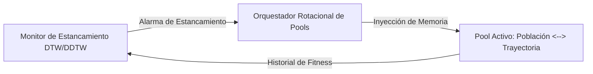

# Sección 1: Introducción (Manuscrito Extendido)

---

## 1. INTRODUCCIÓN (Introduction)

### 1.1. Contexto, Motivación y Marco de Referencia
La resolución computacional de problemas de optimización de alta complejidad constituye uno de los pilares fundamentales de la investigación operacional, la ingeniería de sistemas y la inteligencia artificial moderna. En la práctica, estos problemas abarcan desde dimensiones discretas y combinatorias de gran escala —como el Problema de la Mochila Multidimensional (*Multidimensional Knapsack Problem*, MKP)— hasta espacios continuos no lineales altamente no convexos (tales como la suite de funciones benchmark CEC2022), alcanzando aplicaciones industriales del mundo real como el dimensionamiento tecno-económico y despacho horario de Microredes Híbridas de Energía Renovable e Hidrógeno Verde (HRES2-H2).

Durante las últimas tres décadas, los algoritmos metaheurísticos han demostrado una notable capacidad para encontrar soluciones sustancialmente cercanas al óptimo global en tiempos computacionales razonables ([Talbi, 2009](https://doi.org/10.1002/9780470496916); [Blum & Roli, 2003](https://doi.org/10.1145/937503.937505)). Estos métodos se categorizan tradicionalmente en dos grandes paradigmas:
1. **Metaheurísticas Basadas en Poblaciones:** Algoritmos como la Optimización por Enjambre de Partículas (*Particle Swarm Optimization*, PSO) ([Kennedy & Eberhart, 1995](https://doi.org/10.1109/ICNN.1995.488968)), el Algoritmo del Lobo Gris (*Grey Wolf Optimizer*, GWO) ([Mirjalili et al., 2014](https://doi.org/10.1016/j.advengsoft.2013.12.007)), la Optimización por Caza de Ballenas (*Whale Optimization Algorithm*, WOA) ([Mirjalili & Lewis, 2016](https://doi.org/10.1016/j.advengsoft.2016.01.008)), la Optimización por Manadas de Alces (*Elk Herd Optimizer*, EHO), el Sistema de Colonias de Hormigas (*Ant Colony System*, ACO) ([Dorigo & Gambardella, 1997](https://doi.org/10.1109/4235.585892)) y la Colonia Artificial de Abejas (*Artificial Bee Colony*, ABC) ([Karaboga & Basturk, 2007](https://doi.org/10.1007/s10898-007-9149-x)). Estos algoritmos destacan por su capacidad de exploración global (*diversificación*) a lo largo de amplias regiones del espacio de búsqueda.
2. **Metaheurísticas Basadas en Trayectorias:** Algoritmos de solución única como la Búsqueda Local Iterada (*Iterated Local Search*, ILS) y el Enfriamiento Simulado (*Simulated Annealing*, SA) ([Kirkpatrick et al., 1983](https://doi.org/10.1126/science.220.4598.671)). Estos métodos destacan por su capacidad de intensificación (*explotación local*) en vecindarios prometedores.

Sin embargo, el **Teorema del No Free Lunch** (*No Free Lunch Theorem*, NFL) formulado por [Wolpert & Macready (1997)](https://doi.org/10.1109/4235.585893) establece de forma matemáticamente rigurosa que ningún algoritmo de optimización único es capaz de superar a todos los demás cuando su rendimiento se promedia sobre el conjunto de todos los problemas posibles. En consecuencia, la búsqueda de una arquitectura algorítmica capaz de adaptar dinámicamente sus estrategias de exploración y explotación representa un desafío científico abierto.

---

### 1.2. Planteamiento del Problema (Problem Statement & Limitations)

A pesar de los importantes avances en el desarrollo de algoritmos metaheurísticos, las aproximaciones convencionales presentes en la literatura actual sufren tres limitaciones estructurales severas:

#### A. Estancamiento Prematuro y Pérdida de Diversidad Genotípica
Las metaheurísticas poblacionales exhiben una convergencia acelerada durante las iteraciones iniciales. No obstante, a medida que la población evoluciona, los individuos se agrupan en torno a atractores locales, desencadenando una rápida degradación de la diversidad genotípica y fenotípica ([Črepinšek et al., 2013](https://doi.org/10.1145/2480741.2480752)). Una vez alcanzado este estado de estancamiento prematuro, continuar ejecutando el mismo operador poblacional resulta computacionalmente ineficiente, consumiendo evaluaciones de la función objetivo sin lograr ganancias significativas en la calidad de la solución. `[CITA REQUERIDA: Estudio específico sobre pérdida de diversidad genotípica en algoritmos poblacionales]`

#### B. Rigidez en los Mecanismos de Control y Switching Estático
Para mitigar el estancamiento, la investigación ha recurrido a arquitecturas híbridas y hiperheurísticas ([Burke et al., 2013](https://doi.org/10.1057/jors.2013.71)). Sin embargo, la gran mayoría de estos esquemas híbridos utilizan reglas de conmutación estáticas basadas en iteraciones fijas (por ejemplo, alternar cada $N$ iteraciones entre PSO y SA) o en contadores de paciencia simples (conteo estático de iteraciones sin mejora). 
* Estos criterios carecen de una evaluación cuantitativa en tiempo real sobre el gradiente o la tasa de convergencia del algoritmo.
* Ignoran si la metaheurística activa aún posee potencial de mejora o si, por el contrario, ha entrado prematuramente en una meseta asintótica. `[CITA REQUERIDA: Trabajo previo sobre limitaciones de conmutación por iteraciones fijas en hiperheurísticas]`

#### C. Falta de Generalización y Rigidez Multidominio
La abrumadora mayoría de los marcos de optimización híbridos descritos en la literatura se diseñan a la medida (*ad-hoc*) para un único dominio de problemas (exclusivamente optimización combinatoria discreta o únicamente funciones benchmark continuas). 
* Raras veces un mismo motor de orquestación logra demostrar invariancia estructural y superioridad estadística simultáneamente en:
  1. Optimización discreta de alta restricción (MKP) ([Chu & Beasley, 1998](https://doi.org/10.1023/A:1009642405419)).
  2. Benchmarks continuos no convexos y rotados (CEC2022) ([Kumar et al., 2022](https://github.com/P-N-Suganthan/CEC2022)).
  3. Sistemas de simulación física y tecno-económica del mundo real (HRES2-H2) ([Li et al., 2021](https://doi.org/10.1016/j.enconman.2021.114587); [Rezaei et al., 2023](https://doi.org/10.1016/j.jclepro.2022.135316)). `[CITA REQUERIDA: Trabajo sobre falta de generalización multidominio en optimización híbrida]`

---

### 1.3. Propuesta de Solución: Framework Híbrido Rotacional Guiado por DTW

Para resolver de manera integral las deficiencias identificadas, este trabajo propone un novedoso **Framework Híbrido Rotacional Adaptativo gobernado por un Monitor de Estancamiento basado en Dynamic Time Warping (DTW / DDTW)**.

La arquitectura metodológica se fundamenta en tres pilares interconectados:

1. **Monitoreo Continuo de Convergencia por Alineamiento Temporal (DTW/DDTW):**  
   En lugar de emplear reglas estáticas, el algoritmo evalúa continuamente la distancia elástica entre el perfil de fitness reciente y una trayectoria ideal de mejora constante utilizando Dynamic Time Warping ([Berndt & Clifford, 1994](https://www.aaai.org/Papers/Workshops/1994/WS-94-03/WS94-03-031.pdf)) y su variante derivada DDTW ([Keogh & Pazzani, 2001](https://doi.org/10.1145/502512.502515)). La adaptación dinámica de umbrales mediante percentiles históricos ($P_{low}$ y $P_{high}$) permite detectar con alta precisión la pérdida de pendiente y el inicio de mesetas sin caer en falsos positivos. `[CITA REQUERIDA: Aplicación de DTW en análisis de series temporales de optimización si se conoce]`

2. **Orquestación Rotacional por Alternancia de Pools:**  
   El motor orquestador organiza las metaheurísticas en dos conjuntos complementarios:
   - **Pool Poblacional (Exploración Global):** PSO, GWO, WOA, EHO, ACO y ABC.
   - **Pool de Trayectoria (Intensificación Local):** ILS y SA.  
   Tan pronto como el monitor DTW detecta un estancamiento en el algoritmo activo, el orquestador aborta la época actual y conmuta de forma rotacional hacia el pool complementario, garantizando un equilibrio dinámico entre diversificación e intensificación.

3. **Inyección de Memoria y Transferencia Genotípica:**  
   En cada conmutación de fase, la mejor solución global alcanzada hasta el momento se inyecta directamente como semilla en la población o vector de inicio del nuevo algoritmo activado, maximizando la explotación del conocimiento acumulado sin destruir la capacidad de escape.

---

### 1.4. Principales Contribuciones Científicas

Las contribuciones originales de esta investigación se resumen en cuatro puntos principales:

1. **Novedoso Criterio de Rotación Dinámica Basado en DTW/DDTW:**  
   Se introduce por primera vez un mecanismo de conmutación de metaheurísticas gobernado por el alineamiento elástico de series temporales de fitness, sustituyendo los contadores estáticos por una detección adaptativa basada en la geometría de convergencia.

2. **Arquitectura Rotacional de Doble Pool con Inyección Semilla:**  
   Se formula un esquema de cooperación sinérgico entre un *Pool Poblacional* amplio (6 metaheurísticas) y un *Pool de Trayectoria* (2 metaheurísticas), optimizando la transferencia de memoria genotípica entre transiciones.

3. **Validación Experimental Multidominio Unificada:**  
   Se demuestra la versatilidad e invariancia del framework aplicándolo sin modificaciones estructurales en tres dominios complejos:
   - *Combinatorio Discreto:* Benchmark MKP de Chu & Beasley (Mknapcb).
   - *Continuo Benchmark:* Suite estándar IEEE CEC2022 (F1–F12).
   - *Ingeniería Real:* Dimensionamiento y despacho horario (8,760 h) del sistema HRES2-H2, optimizando LCOE, LCOH y AGSR.

4. **Rigurosa Validación Estadística Inferencial No Paramétrica:**  
   Toda la evaluación experimental cuenta con respaldo inferencial automatizado conforme a los estándares de la comunidad ([Derrac et al., 2011](https://doi.org/10.1016/j.swevo.2011.02.002); [García et al., 2010](https://doi.org/10.1007/s10489-008-0159-9)), incluyendo pruebas de normalidad (Shapiro-Wilk), comparación por pares (Wilcoxon Signed-Rank, Mann-Whitney U) y ranking global no paramétrico (Friedman Rank Test).

---

### 1.5. Organización del Documento (Roadmap)

El resto de este artículo se estructura de la siguiente manera:
- **Sección 2 (Estado del Arte y Trabajos Relacionados):** Revisa la literatura existente sobre metaheurísticas híbridas, métodos de control de estancamiento, optimización de sistemas HRES2-H2 y el uso de pruebas estadísticas.
- **Sección 3 (Metodología del Framework Híbrido DTW):** Detalla el algoritmo del monitor DTW/DDTW, la configuración de pools y el flujo de inyección de memoria.
- **Sección 4 (Formulación Matemática de los Problemas Benchmark):** Describe las ecuaciones y restricciones de MKP, CEC2022 y la simulación físico-económica del sistema HRES2-H2.
- **Sección 5 (Resultados Experimentales y Análisis Inferencial):** Presenta las comparativas tabulares, diagramas de convergencia, boxplots, mapas Gantt de switches y tablas de $p$-valores de Wilcoxon/Friedman.
- **Sección 6 (Conclusiones y Trabajo Futuro):** Sintetiza los hallazgos clave y plantea futuras extensiones del trabajo.

---

📌 **Nota de Citas:** Las citas con el formato `[CITA REQUERIDA: <descripción>]` señalan puntos específicos donde el usuario puede incluir referencias adicionales de su literatura local o del dominio si lo requiere. Todas las referencias principales con DOI están disponibles en [`paper/referencias_bibliograficas.md`](file:///c:/Users/Lucas/Desktop/mkp_lb2/paper/referencias_bibliograficas.md).
