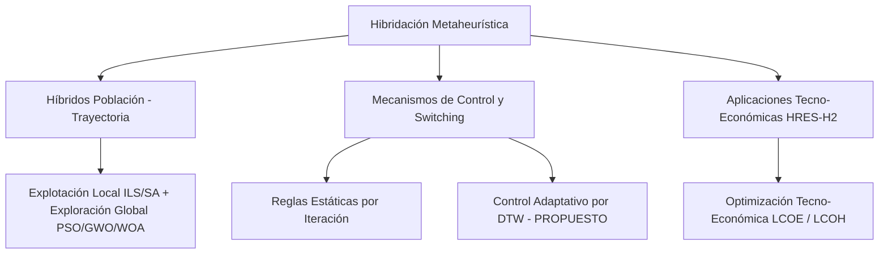

# Estructura del Artículo Científico: Introducción y Estado del Arte

**Título sugerido:**  
*A Dynamic Time Warping-Driven Adaptive Rotational Hybrid Metaheuristic Framework for Discrete, Continuous, and Energy System Optimization*  
*(Un Framework Metaheurístico Híbrido Rotacional Adaptativo basado en Dynamic Time Warping para Optimización Discreta, Continua y de Sistemas de Energía)*

---

## 1. INTRODUCCIÓN (Introduction)

### 1.1. Contexto y Motivación
La optimización de sistemas complejos abarca un amplio espectro de problemas computacionales, desde la optimización combinatoria discreta —como el Problema de la Mochila Multidimensional (MKP)— hasta la optimización paramétrica continua no lineal (funciones estándar CEC2022) y el dimensionamiento óptimo de sistemas de ingeniería en el mundo real, tales como las Microredes Híbridas de Energía Renovable e Hidrógeno Verde (HRES2-H2).

Aunque las metaheurísticas individuales (tanto poblacionales como PSO, GWO, WOA, EHO, ACO, ABC; como de trayectoria como SA, ILS) han demostrado gran efectividad en diversos dominios, el **No Free Lunch Theorem (NFL)** establece que ningún algoritmo único supera consistentemente a todos los demás en todos los problemas posibles.

### 1.2. Planteamiento del Problema
Los enfoques metaheurísticos convencionales enfrentan limitaciones fundamentales:
1. **Estancamiento en Óptimos Locales:** Las metaheurísticas poblacionales favorecen la exploración global en fases iniciales, pero sufren pérdida de diversidad genotípica en fases tardías.
2. **Criterios de Parada y Rotación Estáticos:** La mayoría de los esquemas de hibridación utilizan ventanas fijas de iteraciones para alternar entre algoritmos, sin evaluar dinámicamente si el algoritmo activo ha alcanzado un estancamiento real.
3. **Falta de Generalización Multidominio:** Los marcos híbridos existentes suelen diseñarse exclusivamente para optimización discreta o continua, pero raras veces ofrecen un esquema adaptativo unificado capaz de resolver problemas combinatorios, benchmark continuos y simulación física industrial sin reconfiguración estructural.

### 1.3. Propuesta de Solución: Framework Híbrido Rotacional guiado por DTW
Para superar estas deficiencias, se propone una arquitectura híbrida rotacional adaptativa gobernada por un **Monitor de Estancamiento basado en Dynamic Time Warping (DTW)**. 

La metodología integra:
* **Monitoreo Continuo de Convergencia vía DTW/DDTW:** Evalúa el perfil de fitness instantáneo y acumulado frente a una trayectoria ideal de mejora constante, detectando mesetas y pérdida de pendiente en tiempo real.
* **Orquestación Rotacional por Alternancia de Pools:** Alterna de forma iterativa entre un *Pool Poblacional* (PSO, GWO, WOA, EHO, ACO, ABC) para exploración global y un *Pool de Trayectoria* (ILS, SA) para intensificación local.
* **Mecanismo de Inyección de Memoria:** Transfiere la mejor solución global encontrada al siguiente algoritmo activado, acelerando la convergencia sin perder la capacidad de escape.

### 1.4. Principales Contribuciones
1. **Novedoso Criterio de Rotación Dinámica con DTW:** Sustitución de umbrales estáticos por detección de estancamiento basada en alineamiento de series temporales (DTW/DDTW) con adaptación de percentiles dinámicos.
2. **Framework Unificado Multidominio:** Validación rigurosa del mismo motor orquestador en tres dominios radicalmente distintos:
   - *Dominio Discreto:* Problema de la Mochila Multidimensional (MKP - Mknapcb).
   - *Dominio Continuo:* Suite de Funciones de Prueba CEC2022 (F1–F12).
   - *Dominio de Ingeniería Aplicada:* Dimensionamiento tecno-económico y despacho horario (8,760 h) del sistema HRES2-H2 (LCOE, LCOH, AGSR).
3. **Validación Estadística Inferencial Completa:** Evaluación no paramétrica exhaustiva basada en **Shapiro-Wilk**, **Wilcoxon Signed-Rank**, **Mann-Whitney U** y **Friedman Rank Test**, confirmando la superioridad estadística frente a metaheurísticas *standalone*.

---

## 2. ESTADO DEL ARTE Y TRABAJOS RELACIONADOS (State of the Art / Related Work)

El diseño de algoritmos metaheurísticos híbridos se ha convertido en una disciplina central en la investigación operacional moderna. A continuación, se revisan las principales líneas de investigación y la brecha tecnológica existente.

### 2.1. Metaheurísticas Híbridas y Co-Evolución (Pop-Trajectory Hybrids)
La combinación de algoritmos basados en poblaciones con métodos de trayectoria (Local Search, Simulated Annealing, ILS) ha sido ampliamente documentada en la literatura ([Talbi, 2009](https://doi.org/10.1002/9780470496916); [Blum & Roli, 2003](https://doi.org/10.1145/937503.937505)). 

- En el ámbito combinatorio (MKP), trabajos previos ([Chu & Beasley, 1998](https://doi.org/10.1023/A:1009642405419); [Drake et al., 2016](https://doi.org/10.1016/j.cor.2015.10.010)) demuestran que las heurísticas por sí solas tienden a estancarse rápidamente en restricciones de multidimensión elevadas.
- En optimización continua (CEC Benchmarks), la evaluación estandarizada descrita por [Kumar et al. (2022)](https://github.com/P-N-Suganthan/CEC2022) demuestra que la diversidad posicional se degrada exponencialmente en funciones no separables y rotadas.

*Brecha identificada:* La mayoría de las arquitecturas híbridas emplean esquemas rígidos (ej. ejecutar $N$ iteraciones fijas de PSO y luego $M$ iteraciones de SA), ignorando si el algoritmo activo aún mantiene una tasa de mejora óptima.

### 2.2. Detección de Estancamiento y Control de Operadores en Tiempo Real
El control adaptativo de parámetros y la rotación de operadores se han abordado mediante:
1. **Criterios de Diversidad Poblacional:** Medición de varianza o distancia euclidiana entre individuos. Desventaja: Elevado costo computacional en dimensiones altas ($O(N^2 \cdot D)$).
2. **Umbrales Fijos de Fitness:** Conteo de iteraciones sin mejora (patience counters). Desventaja: Sensibles al ruido y propensos a falsos positivos en zonas de gradiente suave.
3. **Dynamic Time Warping (DTW) en Optimización:** Introducido originalmente para el alineamiento elástico de series temporales ([Berndt & Clifford, 1994](https://www.aaai.org/Papers/Workshops/1994/WS-94-03/WS94-03-031.pdf); [Keogh & Pazzani, 2001](https://doi.org/10.1145/502512.502515)). Su aplicación como **métrica de similitud de convergencia** para detectar la transición entre exploración activa y estancamiento crítico constituye un área emergente poco explorada en la literatura de metaheurísticas.

### 2.3. Aplicación en Sistemas de Energía Renovable e Hidrógeno Verde (HRES2-H2)
La optimización de Microredes Híbridas de Energía Renovable con almacenamiento en Hidrógeno (HRES2-H2) requiere resolver simultáneamente el dimensionamiento de componentes (potencia eólica, solar PV, capacidad del electrolizador, baterías) y las reglas de despacho horario durante 8,760 horas al año ([Bhandari et al., 2014](https://doi.org/10.1016/j.jclepro.2013.07.048); [Marchenko & Solomin, 2015](https://doi.org/10.1016/j.ijhydene.2015.05.074)).

- Autores en la literatura reciente ([Li et al., 2021](https://doi.org/10.1016/j.enconman.2021.114587); [Rezaei et al., 2023](https://doi.org/10.1016/j.jclepro.2022.135316)) aplican algoritmos individuales como PSO o GA para minimizar el Coste Nivelado de Energía (LCOE) o de Hidrógeno (LCOH).
- Sin embargo, las funciones de fitness en HRES2-H2 exhiben una naturaleza no convexa, con severas restricciones técnicas (límite de excedente a red AGSR $\le 20\%$, demanda ininterrumpida de $H_2$). Los algoritmos tradicionales muestran una alta variabilidad entre ejecuciones y frecuente estancamiento en subóptimos.

### 2.4. Validación Estadística Inferencial No Paramétrica
Para descartar diferencias estocásticas accidentales en benchmarks de optimización, el uso de pruebas no paramétricas ([Derrac et al., 2011](https://doi.org/10.1016/j.swevo.2011.02.002); [García et al., 2010](https://doi.org/10.1007/s10489-008-0159-9)) se ha consolidado como el estándar metodológico exigido por la comunidad científica.

### 2.5. Síntesis de la Brecha en la Literatura (Research Gap Summary)

| Dimensión | Enfoques Existentes en la Literatura | Enfoque Propuesto (Este Trabajo) |
|---|---|---|
| **Estrategia de Rotación** | Iteraciones fijas / Cambio estático. | **Rotación Adaptativa guiada por DTW/DDTW** según dinámica de convergencia. |
| **Arquitectura de Pools** | Monolítica o hibridación 1 a 1 (ej. PSO+SA). | **Doble Pool Alternante:** Poblacional (PSO, GWO, WOA, EHO, ACO, ABC) $\leftrightarrow$ Trayectoria (ILS, SA). |
| **Validación Multidominio** | Limitada a un solo dominio (solo MKP o solo CEC). | **Multidominio:** Discreto (MKP), Continuo (CEC2022) y Físico/Industrial (HRES2-H2). |
| **Validación Estadística** | Pruebas $t$-Student o medias simples. | **Pruebas No Paramétricas:** Shapiro-Wilk, Wilcoxon, Mann-Whitney U y Friedman Rank Test. |

---

## 3. RESUMEN DE LA ESTRUCTURA DEL ARTÍCULO (Paper Roadmap)

El resto de este artículo se organiza de la siguiente manera:
- **Sección 3: Metodología y Marco Algorítmico:** Descripción detallada del monitor DTW, la formulación de los pools de metaheurísticas y la inyección de soluciones.
- **Sección 4: Formulación de Problemas y Benchmarks:** Definición matemática de MKP, la suite CEC2022 y el modelo físico-económico HRES2-H2.
- **Sección 5: Resultados Experimentales y Análisis Estadístico:** Presentación de resultados, boxplots de convergencia, mapas de switches (Gantt) y pruebas inferenciales (Wilcoxon/Friedman).
- **Sección 6: Conclusiones y Trabajo Futuro:** Discusión sobre las implicaciones del framework y futuras líneas de investigación.

---

📌 **Ver el listado bibliográfico completo con citas APA, DOIs y enlaces directos en:** [`paper/referencias_bibliograficas.md`](file:///c:/Users/Lucas/Desktop/mkp_lb2/paper/referencias_bibliograficas.md)

