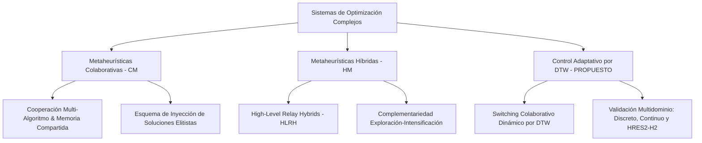

# Estructura del Artículo Científico: Introducción y Estado del Arte (Enfoque en Metaheurísticas Colaborativas)

**Título sugerido:**  
*A Dynamic Time Warping-Driven Adaptive Collaborative Metaheuristic Framework for Discrete, Continuous, and Renewable Energy System Optimization*  
*(Un Framework Metaheurístico Colaborativo Adaptativo basado en Dynamic Time Warping para Optimización Discreta, Continua y de Sistemas de Energía Renovable)*

---

## 1. INTRODUCCIÓN (Introduction)

### 1.1. Contexto y Motivación
La resolución de problemas de optimización complejos —que abarcan desde la optimización combinatoria discreta (Problema de la Mochila Multidimensional, MKP) hasta funciones de referencia continuas no lineales (CEC2022) y el dimensionamiento tecno-económico de sistemas energéticos industriales (Microredes Híbridas HRES2-H2)— exige estrategias de búsqueda altamente eficientes. 

El **No Free Lunch Theorem (NFL)** establece que ningún algoritmo de optimización único puede superar a todos los demás en todas las clases de problemas. Para superar esta restricción, el paradigma de las **Metaheurísticas Colaborativas (Collaborative / Cooperative Metaheuristics - CM)** propone la cooperación sinérgica de múltiples algoritmos autónomos que comparten información diagnóstica y memorias de búsqueda para lograr un desempeño global superior al de cualquiera de sus componentes por separado.

### 1.2. Planteamiento del Problema
A pesar de la efectividad teórica de las metaheurísticas colaborativas, los enfoques actuales presentan serias limitaciones metodológicas:
1. **Dilema del Control de Comunicación ("Cuándo Colaborar"):** Los marcos colaborativos tradicionales utilizan protocolos estáticos (ej. migración o intercambio de soluciones cada $K$ iteraciones fijas). Esto provoca *colaboración prematura* (interrumpiendo fases de exploración óptimas) o *colaboración tardía* (desperdiciando cómputo en algoritmos ya estancados).
2. **Estancamiento y Pérdida de Diversidad:** Cuando una metaheurística activa alcanza una meseta de convergencia (óptimo local), continuar su ejecución degrada el rendimiento global del sistema colaborativo.
3. **Generalización Multidominio Rígida:** La mayoría de los marcos cooperativos están diseñados para un único tipo de problema (discreto o continuo), careciendo de la flexibilidad para adaptar dinámicamente sus *pools* de algoritmos colaboradores según la naturaleza del dominio.

### 1.3. Propuesta de Solución: Framework Colaborativo Adaptativo guiado por DTW
Para resolver el dilema de comunicación y maximizar la sinergia algorítmica, se propone un **Framework Metaheurístico Colaborativo Adaptativo** cuyo mecanismo de control está gobernado en tiempo real por un **Monitor de Estancamiento basado en Dynamic Time Warping (DTW)**.

La arquitectura colaborativa se fundamenta en tres pilares:
* **Monitoreo elástico de Convergencia vía DTW/DDTW:** El monitor evalúa continuamente la trayectoria de convergencia instantánea y acumulada frente a un perfil ideal de mejora ($D_1$ vs $D_2$). El evento de conmutación colaborativa se activa únicamente cuando se detecta un estancamiento real en la búsqueda.
* **Protocolo Dinámico de Transferencia e Inyección de Memoria:** Al activarse la conmutación, la mejor solución global alcanzada ($x_{best}$) se transfiere e inyecta en el nuevo algoritmo activado, reorientando su población o punto inicial de búsqueda (*Elitist Memory Injection*) sin destruir la capacidad de escape.
* **Arquitectura Flexible de Pools Colaborativos:** El marco adapta los algoritmos colaboradores según el problema:
  - *Dominio Discreto (MKP) e Industrial (HRES2-H2):* Alternancia cooperativa entre *Pool Poblacional* (PSO, GWO, WOA, EHO, ACO, ABC) y *Pool de Trayectoria* (ILS, SA).
  - *Dominio Continuo (CEC2022):* Cooperación adaptativa entre múltiples solvers exclusivamente poblacionales (PSO, GWO, WOA, EHO, ACO, ABC).

### 1.4. Principales Contribuciones
1. **Novedoso Protocolo Colaborativo Adaptativo por DTW:** Eliminación de frecuencias de comunicación fijas mediante la activación dinámica de transferencias basada en alineamiento elástico de series temporales de convergencia.
2. **Esquema de Inyección Elitista de Memoria:** Mecanismo de cooperación que acelera el reinicio y la convergencia de solvers heterogéneos mediante la preservación e inyección del estado global óptimo.
3. **Validación Empírica Multidominio Unificada:** Demostración experimental del mismo motor colaborativo en tres dominios representativos (MKP discreto, CEC2022 continuo no lineal, y simulación horaria 8,760 h del sistema HRES2-H2).
4. **Evaluación Estadística Inferencial Rigurosa:** Confirmación no paramétrica (**Shapiro-Wilk**, **Wilcoxon Signed-Rank**, **Mann-Whitney U**, **Friedman Rank Test**) que respalda estadísticamente las ganancias de la colaboración adaptativa frente a solvers *standalone*.

---

## 2. ESTADO DEL ARTE Y TRABAJOS RELACIONADOS (State of the Art / Related Work)

El diseño de metaheurísticas colaborativas e híbridas representa la frontera del conocimiento en investigación operacional. A continuación, se estructuran sus fundamentos teóricos y la brecha en la literatura.

### 2.1. Metaheurísticas Colaborativas y Sistemas Cooperativos (Collaborative Metaheuristics - CM)
De acuerdo con las taxonomías fundamentales de [Crainic & Toulouse (2003, 2010)](https://doi.org/10.1007/978-1-4419-1665-5_17), [El-Abd & Kamel (2005)](https://doi.org/10.1007/11546241_73) y [Alba (2005)](https://doi.org/10.1007/b106656), los esquemas colaborativos o cooperativos consisten en múltiples agentes de búsqueda que intercambian conocimiento a través de un protocolo de comunicación:

- **Estructura de Comunicación e Intercambio de Información:** El conocimiento compartido incluye las mejores soluciones globales, memorias de frecuencia de atributos o poblaciones completas. La *inyección de memoria elitista* ($x_{best}$) utilizada en nuestra propuesta asegura que el nuevo algoritmo comience su fase de exploración a partir de la mejor región factible descubierta previamente.
- **Deficiencia de la Frecuencia Fija de Comunicación:** La principal brecha en la literatura de metaheurísticas colaborativas reside en el uso de intervalos de comunicación constantes ($K$ iteraciones). Si $K$ es pequeño, la sobrecomunicación destruye la diversidad local; si $K$ es grande, los algoritmos permanecen atrapados en óptimos locales perdiendo tiempo computacional.

### 2.2. Taxonomía de Metaheurísticas Híbridas (Hybrid Metaheuristics - HM)
Las taxonomías clásicas de [Talbi (2002, 2009)](https://doi.org/10.1002/9780470496916), [Blum & Roli (2003)](https://doi.org/10.1145/937503.937505) y [Raidl (2006)](https://doi.org/10.1007/11844297_1) clasifican la integración algorítmica en:

1. **High-Level Hybrids (HLH):** Los algoritmos conservan su estructura interna independiente y cooperan mediante un nivel de control superior (nuestro framework opera como HLH).
2. **Relay Rotational Hybrids (HLRH):** Ejecución secuencial o rotacional con traspaso de soluciones entre algoritmos complementarios (ej. exploración poblacional $\leftrightarrow$ explotación de trayectoria en MKP y HRES2-H2; o rotación entre solvers poblacionales en CEC2022).

### 2.3. Dynamic Time Warping (DTW) como Orquestador Adaptativo de Comunicación
Para superar la rigidez de los protocolos de colaboración tradicionales, se introduce el **Dynamic Time Warping (DTW)** ([Berndt & Clifford, 1994](https://www.aaai.org/Papers/Workshops/1994/WS-94-03/WS94-03-031.pdf); [Keogh & Pazzani, 2001](https://doi.org/10.1145/502512.502515)) como métrica elástica de estancamiento. Al comparar la serie temporal de convergencia contra trayectorias teóricas ($D_1$ vs $D_2$), el sistema determina el momento exacto en que la colaboración es necesaria, maximizando la eficiencia computacional.

### 2.4. Aplicación en Microredes de Energía Renovable e Hidrógeno Verde (HRES2-H2)
La optimización tecno-económica de Microredes HRES2-H2 implica la determinación simultánea de capacidades de componentes (Eólica, PV, Electrolizador, Baterías) y despacho horario (8,760 h) ([Bhandari et al., 2014](https://doi.org/10.1016/j.jclepro.2013.07.048); [Rezaei et al., 2023](https://doi.org/10.1016/j.jclepro.2022.135316)). La naturaleza altamente restringida y no convexa del problema (AGSR $\le 20\%$, demanda ininterrumpida de $H_2$) hace de HRES2-H2 un escenario ideal para evaluar las ganancias de las metaheurísticas colaborativas.

### 2.5. Validación Estadística Inferencial No Paramétrica
De acuerdo con el estándar metodológico ([Derrac et al., 2011](https://doi.org/10.1016/j.swevo.2011.02.002); [García et al., 2010](https://doi.org/10.1007/s10489-008-0159-9)), se aplican pruebas no paramétricas exhaustivas para validar la significación estadística del framework colaborativo frente a metaheurísticas individuales.

### 2.6. Síntesis de la Brecha en la Literatura (Research Gap Summary)

| Dimensión | Enfoques Existentes en la Literatura | Enfoque Propuesto (Este Trabajo) |
|---|---|---|
| **Paradigma Principal** | Algoritmos aislados o hibridación rígida 1-a-1. | **Framework Colaborativo Adaptativo de Alto Nivel (HLRH/CM)** con pools de solvers autónomos. |
| **Protocolo de Comunicación** | Intercambio/migración cada $K$ iteraciones fijas. | **Colaboración Adaptativa activada por DTW/DDTW** basada en perfil de convergencia en tiempo real. |
| **Mecanismo de Memoria** | Sin transferencia o reemplazo completo de población. | **Inyección Elitista de Memoria ($x_{best}$)** que reorienta el reinicio sin perder capacidad de escape. |
| **Flexibilidad de Pools** | Estructura fija y no adaptable al dominio. | **Pools Dinámicos por Dominio:** Población/Trayectoria (MKP, HRES2-H2) o Poblacional puro (CEC2022). |
| **Validación Multidominio** | Limitada a un solo tipo de benchmark. | **Demostración Multidominio Unificada:** Combinatorio Discreto (MKP), Continuo Paramétrico (CEC2022) y Sistema Físico Industrial (HRES2-H2). |
| **Análisis Estadístico** | Comparación de medias simples o pruebas $t$-Student. | **Validación Inferencial No Paramétrica:** Shapiro-Wilk, Wilcoxon, Mann-Whitney U y Test de Friedman. |

---

## 3. RESUMEN DE LA ESTRUCTURA DEL ARTÍCULO (Paper Roadmap)

El resto de este artículo se organiza de la siguiente manera:
- **Sección 3: Metodología Colaborativa y Marco Algorítmico:** Descripción matemática del monitor DTW, formulación de pools colaborativos e inyección elitista de memoria.
- **Sección 4: Formulación de Problemas y Benchmarks:** Definición detallada de MKP (discreto), suite CEC2022 (continuo) y modelo físico-económico HRES2-H2.
- **Sección 5: Resultados Experimentales y Análisis Estadístico:** Evaluación de resultados, boxplots de dispersión, diagramas de Gantt de switches y pruebas inferenciales (Wilcoxon/Friedman).
- **Sección 6: Conclusiones y Trabajo Futuro:** Discusión sobre los aportes del paradigma colaborativo adaptativo y futuras extensiones.

---

📌 **Ver el listado bibliográfico completo con citas APA, DOIs y enlaces directos en:** [`paper/referencias_bibliograficas.md`](file:///c:/Users/Lucas/Desktop/mkp_lb2/paper/referencias_bibliograficas.md)

