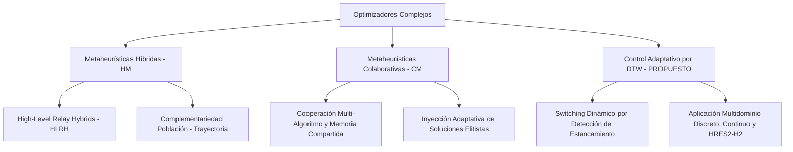

# Estructura del Artículo Científico: Introducción y Estado del Arte

**Título sugerido:**  
*A Dynamic Time Warping-Driven Adaptive Rotational Hybrid Metaheuristic Framework for Discrete, Continuous, and Energy System Optimization*  
*(Un Framework Metaheurístico Híbrido Rotacional Adaptativo basado en Dynamic Time Warping para Optimización Discreta, Continua y de Sistemas de Energía)*

---

## 1. INTRODUCCIÓN (Introduction)

### 1.1. Contexto y Motivación
La optimización de sistemas complejos abarca un amplio espectro de problemas computacionales, desde la optimización combinatoria discreta —como el Problema de la Mochila Multidimensional (MKP)— hasta la optimización paramétrica continua no lineal (funciones estándar CEC2022) y el dimensionamiento óptimo de sistemas de ingeniería en el mundo real, tales como las Microredes Híbridas de Energía Renovable e Hidrógeno Verde (HRES2-H2).

Aunque las metaheurísticas individuales (tanto poblacionales como PSO, GWO, WOA, EHO, ACO, ABC; como de trayectoria como SA, ILS) han demostrado gran efectividad en diversos dominios, el **No Free Lunch Theorem (NFL)** establece que ningún algoritmo único supera consistentemente a todos los demás en todos los problemas posibles.

### 1.2. Planteamiento del Problema
Los enfoques metaheurísticos convencionales enfrentan limitaciones fundamentales:
1. **Estancamiento en Óptimos Locales:** Las metaheurísticas poblacionales favorecen la exploración global en fases iniciales, pero sufren pérdida de diversidad genotípica en fases tardías.
2. **Criterios de Parada y Rotación Estáticos:** La mayoría de los esquemas de hibridación utilizan ventanas fijas de iteraciones para alternar entre algoritmos, sin evaluar dinámicamente si el algoritmo activo ha alcanzado un estancamiento real.
3. **Falta de Generalización Multidominio:** Los marcos híbridos existentes suelen diseñarse exclusivamente para optimización discreta o continua, pero raras veces ofrecen un esquema adaptativo unificado capaz de resolver problemas combinatorios, benchmark continuos y simulación física industrial sin reconfiguración estructural.

### 1.3. Propuesta de Solución: Framework Híbrido Rotacional guiado por DTW
Para superar estas deficiencias, se propone una arquitectura híbrida rotacional adaptativa gobernada por un **Monitor de Estancamiento basado en Dynamic Time Warping (DTW)**. 

La metodología integra:
* **Monitoreo Continuo de Convergencia vía DTW/DDTW:** Evalúa el perfil de fitness instantáneo y acumulado frente a una trayectoria ideal de mejora constante, detectando mesetas y pérdida de pendiente en tiempo real.
* **Orquestación Rotacional por Alternancia de Pools:** Alterna de forma iterativa entre un *Pool Poblacional* (PSO, GWO, WOA, EHO, ACO, ABC) para exploración global y un *Pool de Trayectoria* (ILS, SA) para intensificación local.
* **Mecanismo de Inyección de Memoria:** Transfiere la mejor solución global encontrada al siguiente algoritmo activado, acelerando la convergencia sin perder la capacidad de escape.

### 1.4. Principales Contribuciones
1. **Novedoso Criterio de Rotación Dinámica con DTW:** Sustitución de umbrales estáticos por detección de estancamiento basada en alineamiento de series temporales (DTW/DDTW) con adaptación de percentiles dinámicos.
2. **Framework Unificado Multidominio:** Validación rigurosa del mismo motor orquestador en tres dominios radicalmente distintos:
   - *Dominio Discreto:* Problema de la Mochila Multidimensional (MKP - Mknapcb).
   - *Dominio Continuo:* Suite de Funciones de Prueba CEC2022 (F1–F12).
   - *Dominio de Ingeniería Aplicada:* Dimensionamiento tecno-económico y despacho horario (8,760 h) del sistema HRES2-H2 (LCOE, LCOH, AGSR).
3. **Validación Estadística Inferencial Completa:** Evaluación no paramétrica exhaustiva basada en **Shapiro-Wilk**, **Wilcoxon Signed-Rank**, **Mann-Whitney U** y **Friedman Rank Test**, confirmando la superioridad estadística frente a metaheurísticas *standalone*.

---

## 2. ESTADO DEL ARTE Y TRABAJOS RELACIONADOS (State of the Art / Related Work)

El diseño de metaheurísticas híbridas y colaborativas se ha consolidado como un paradigma fundamental en la investigación operacional moderna para resolver problemas de optimización np-duros y no convexos. A continuación, se presentan las bases teóricas, taxonomías y la brecha en la literatura.

### 2.1. Taxonomía de Metaheurísticas Híbridas (Hybrid Metaheuristics - HM)
De acuerdo con las taxonomías unificadas de [Talbi (2002, 2009)](https://doi.org/10.1002/9780470496916), [Blum & Roli (2003)](https://doi.org/10.1145/937503.937505) y [Raidl (2006)](https://doi.org/10.1007/11844297_1), las metaheurísticas híbridas se clasifican según la arquitectura de integración y el nivel de control:

1. **Clasificación por Nivel de Integración (High-Level vs. Low-Level):**
   - *Low-Level Hybrids (LLH):* Un operador interno de una metaheurística es reemplazado por otro algoritmo completo (ej. incorporar una búsqueda local interna en cada individuo de un Algoritmo Genético).
   - *High-Level Hybrids (HLH):* Los algoritmos conservan su independencia modular y colaboran mediante esquemas de control externo. El framework propuesto pertenece a esta categoría, preservando la autonomía de cada módulo (`PSO`, `GA`, `GWO`, `DE`, `ACO`, `ABC`, `EHO`, `WOA`, `ILS`, `SA`).

2. **Clasificación por Modo de Ejecución (Relay / Secuencial vs. Co-evolutivo / Paralelo):**
   - *Relay Hybrids (HLRH):* Los algoritmos se ejecutan en secuencia o rotación, transmitiendo la mejor solución encontrada de una metaheurística a la siguiente. 
   - *Sinergia Población-Trayectoria:* La combinación de métodos poblacionales (alta exploración global) con métodos de trayectoria (alta intensificación local en el espacio de búsqueda) permite mitigar el estancamiento prematuro ([Chu & Beasley, 1998](https://doi.org/10.1023/A:1009642405419); [Drake et al., 2016](https://doi.org/10.1016/j.cor.2015.10.010)).

### 2.2. Metaheurísticas Colaborativas y Sistemas Multi-Algoritmo (Collaborative Metaheuristics - CM)
Las metaheurísticas colaborativas o cooperativas ([Crainic & Toulouse, 2003, 2010](https://doi.org/10.1007/978-1-4419-1665-5_25); [El-Abd & Kamel, 2005](https://doi.org/10.1007/11546241_73); [Alba, 2005](https://doi.org/10.1007/b106656)) se definen como sistemas compuestos por múltiples metaheurísticas autónomas (homogéneas o heterogéneas) que intercambian información diagnóstica o de soluciones para acelerar el proceso de búsqueda global.

- **Mecanismos de Transferencia e Inyección de Memoria:** El intercambio de información puede realizarse mediante estructuras de memoria compartida o migración asíncrona de soluciones elitistas. En nuestro diseño colaborativo, la transferencia de la mejor solución global ($x_{best}$) al activar el siguiente solver actúa como una *inyección de memoria guiada*, reorientando la población o el punto de inicio de la nueva metaheurística sin destruir su diversidad.
- **Cuello de Botella de la Colaboración Tradicional:** En la literatura de metaheurísticas colaborativas, el protocolo de intercambio suele ser rígido (ej. migración cada $K$ iteraciones estáticas o al agotar un número fijo de evaluaciones de función). Esto conduce a dos problemas críticos: (a) *Colaboración prematura*, interrumpiendo fases de exploración eficientes; o (b) *Colaboración tardía*, desperdiciando recursos computacionales en zonas estancadas.

### 2.3. Detección de Estancamiento y Control Adaptativo de Conmutación vía DTW
Para resolver el problema del *"cuándo conmutar"* en arquitecturas híbridas y colaborativas, la literatura ha explorado indicadores de diversidad y paciencia. Sin embargo:
1. **Criterios de Diversidad Poblacional:** Medición de varianza o distancia euclidiana entre individuos. Desventaja: Elevado costo computacional en dimensiones altas ($O(N^2 \cdot D)$).
2. **Umbrales Fijos de Fitness:** Conteo de iteraciones sin mejora (patience counters). Desventaja: Sensibles al ruido y propensos a falsos positivos en zonas de gradiente suave.
3. **Dynamic Time Warping (DTW) como Mecanismo de Control:** Desarrollado originalmente para el alineamiento elástico de series temporales ([Berndt & Clifford, 1994](https://www.aaai.org/Papers/Workshops/1994/WS-94-03/WS94-03-031.pdf); [Keogh & Pazzani, 2001](https://doi.org/10.1145/502512.502515)). Su uso como **indicador dinámico de estancamiento en tiempo real** permite evaluar el perfil de mejora en una ventana deslizante frente a una trayectoria teórica de referencia ($D_1$ vs $D_2$), activando el traspaso colaborativo entre algoritmos con máxima precisión temporal.

### 2.4. Aplicación en Sistemas de Energía Renovable e Hidrógeno Verde (HRES2-H2)
La optimización de Microredes Híbridas de Energía Renovable con almacenamiento en Hidrógeno (HRES2-H2) requiere resolver simultáneamente el dimensionamiento de componentes (potencia eólica, solar PV, capacidad del electrolizador, baterías) y las reglas de despacho horario durante 8,760 horas al año ([Bhandari et al., 2014](https://doi.org/10.1016/j.jclepro.2013.07.048); [Marchenko & Solomin, 2015](https://doi.org/10.1016/j.ijhydene.2015.05.074)).

- Autores en la literatura reciente ([Li et al., 2021](https://doi.org/10.1016/j.enconman.2021.114587); [Rezaei et al., 2023](https://doi.org/10.1016/j.jclepro.2022.135316)) aplican algoritmos individuales como PSO o GA para minimizar el Coste Nivelado de Energía (LCOE) o de Hidrógeno (LCOH).
- Sin embargo, las funciones de fitness en HRES2-H2 exhiben una naturaleza no convexa, con severas restricciones técnicas (límite de excedente a red AGSR $\le 20\%$, demanda ininterrumpida de $H_2$). Los algoritmos tradicionales muestran una alta variabilidad entre ejecuciones y frecuente estancamiento en subóptimos.

### 2.5. Validación Estadística Inferencial No Paramétrica
Para descartar diferencias estocásticas accidentales en benchmarks de optimización, el uso de pruebas no paramétricas ([Derrac et al., 2011](https://doi.org/10.1016/j.swevo.2011.02.002); [García et al., 2010](https://doi.org/10.1007/s10489-008-0159-9)) se ha consolidado como el estándar metodológico exigido por la comunidad científica.

### 2.6. Síntesis de la Brecha en la Literatura (Research Gap Summary)

| Dimensión | Enfoques Existentes en la Literatura | Enfoque Propuesto (Este Trabajo) |
|---|---|---|
| **Paradigma Metaheurístico** | Algoritmos monolíticos aislados o híbridos 1-a-1 fijos (ej. PSO+SA). | **Framework Híbrido-Colaborativo de Alto Nivel (HLRH)** con doble pool alternante (Poblacional $\leftrightarrow$ Trayectoria). |
| **Protocolo Colaborativo** | Reglas de intercambio estáticas o migración por iteraciones fijas ($K$). | **Colaboración Adaptativa guiada por DTW/DDTW** con inyección dinámica de memoria en el reinicio de solvers. |
| **Detección de Estancamiento** | Paciencia simple / conteo de iteraciones sin mejora o umbrales estáticos. | **Monitoreo elástico DTW ($D_1$ vs $D_2$)** con umbrales adaptativos por percentiles ($P_{low}, P_{high}$). |
| **Validación Multidominio** | Orientada a un solo tipo de problema (solo discreto o solo continuo). | **Validación Multidominio Unificada:** Combinatorio Discreto (MKP), Continuo Paramétrico (CEC2022) e Ingeniería Real (HRES2-H2). |
| **Validación Estadística** | Medias simples o pruebas $t$-Student asumiendo normalidad. | **Inferencia No Paramétrica Completa:** Shapiro-Wilk, Wilcoxon Signed-Rank, Mann-Whitney U y Test de Friedman. |

---

## 3. RESUMEN DE LA ESTRUCTURA DEL ARTÍCULO (Paper Roadmap)

El resto de este artículo se organiza de la siguiente manera:
- **Sección 3: Metodología y Marco Algorítmico:** Descripción detallada del monitor DTW, la formulación de los pools de metaheurísticas y la inyección de soluciones.
- **Sección 4: Formulación de Problemas y Benchmarks:** Definición matemática de MKP, la suite CEC2022 y el modelo físico-económico HRES2-H2.
- **Sección 5: Resultados Experimentales y Análisis Estadístico:** Presentación de resultados, boxplots de convergencia, mapas de switches (Gantt) y pruebas inferenciales (Wilcoxon/Friedman).
- **Sección 6: Conclusiones y Trabajo Futuro:** Discusión sobre las implicaciones del framework y futuras líneas de investigación.

---

📌 **Ver el listado bibliográfico completo con citas APA, DOIs y enlaces directos en:** [`paper/referencias_bibliograficas.md`](file:///c:/Users/Lucas/Desktop/mkp_lb2/paper/referencias_bibliograficas.md)

